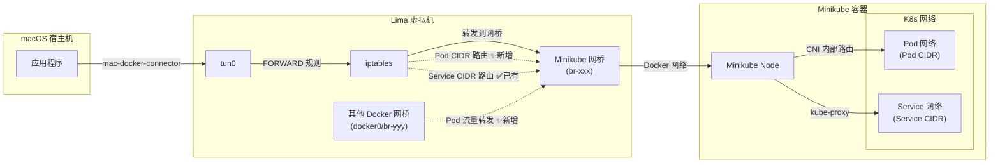
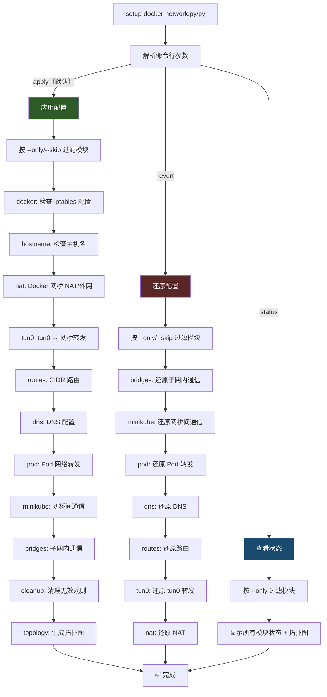

# Pod 网络访问支持

## 需求描述

在现有的 Lima Docker 虚拟机网络配置脚本中，增加对 Kubernetes Pod 网络（Pod CIDR）的访问支持。

### 背景

当前脚本已支持以下网络配置：
- Docker 网桥子网 NAT + 转发
- tun0 ↔ Docker 网桥（macOS 宿主机访问容器）
- Service CIDR 路由
- DNS 解析（cluster.local）
- 网桥间通信

但缺少 **Pod CIDR** 的路由和转发规则配置，导致：
- ❌ 从 Lima 虚拟机内部无法直接 ping Pod IP
- ❌ 从 macOS 宿主机无法通过 tun0 访问 Pod IP
- ❌ 其他 Docker 容器无法直接访问 Pod IP

## 设计方案

### 网络拓扑



### 新增功能

#### 1. Pod CIDR 获取

使用多种方法获取 Pod CIDR，按优先级排序：

> ⚠️ **重要**：必须优先获取集群级 `--cluster-cidr`（覆盖整个集群的 Pod 网段），而非 Node 级 `spec.podCIDR`（仅分配给单个节点的子网，范围较小）。  
> 例如：`--cluster-cidr=x.x.x.x/16` vs `spec.podCIDR=x.x.x.x/24`，前者覆盖范围更大，能路由到所有 Pod。

| 方法 | 命令 | 优先级 | 范围 |
|------|------|--------|------|
| kube-controller-manager --cluster-cidr | `kubectl get pod -n kube-system -l component=kube-controller-manager` | 1 | 集群级 |
| kubeadm-config podSubnet | `kubectl get cm -n kube-system kubeadm-config` | 2 | 集群级 |
| kube-proxy clusterCIDR | `kubectl get cm -n kube-system kube-proxy` | 3 | 集群级 |
| Node spec.podCIDR | `kubectl get nodes -o jsonpath='{.items[*].spec.podCIDR}'` | 4（备用） | 节点级 |

#### 2. Pod CIDR 路由

将 Pod CIDR 路由指向 Minikube 容器 IP：

```bash
ip route add <pod_cidr> via <minikube_container_ip>
```

#### 3. Pod 网络转发规则

配置 iptables 转发规则，使得 tun0 和其他 Docker 网桥都能正确转发 Pod 流量：

```bash
# tun0 → Minikube 网桥（Pod 流量）
iptables -A FORWARD -i tun0 -d <pod_cidr> -o <minikube_bridge> -j ACCEPT
iptables -A FORWARD -i <minikube_bridge> -s <pod_cidr> -o tun0 -j ACCEPT

# 其他 Docker 网桥 → Minikube 网桥（Pod 流量）
iptables -A FORWARD -i <other_bridge> -d <pod_cidr> -o <minikube_bridge> -j ACCEPT
iptables -A FORWARD -i <minikube_bridge> -s <pod_cidr> -o <other_bridge> -j ACCEPT
```

### 步骤编号调整

| 步骤 | 原编号 | 新编号 | 内容 |
|------|--------|--------|------|
| Docker 网桥 NAT | 1 | 1 | 不变 |
| tun0 转发规则 | 2 | 2 | 不变 |
| Minikube 路由 | 3 | 3 | 新增 Pod CIDR 路由 |
| DNS 配置 | 4 | 4 | 不变 |
| **Pod 网络转发** | **无** | **5** | **✨ 新增** |
| 网桥与 Minikube 通信 | 5 | 6 | 编号调整 |
| 网桥子网内通信 | 6 | 7 | 编号调整 |
| 网络拓扑图 | 7 | 8 | 新增 Pod CIDR 展示 |

## 实施进展

### 已完成

- [x] **setup-docker-network.py** 修改
  - [x] 更新脚本头注释
  - [x] `get_minikube_info()` 新增 Pod CIDR 获取（4种方法）
  - [x] 新增 `configure_pod_network_forwarding()` 函数
  - [x] 更新 `configure_minikube_routes()` 增加 Pod CIDR 路由
  - [x] 更新 `generate_topology()` 展示 Pod CIDR
  - [x] `main()` 中新增调用
  - [x] 步骤编号更新（5→6→7→8）

- [x] **setup-docker-network.py** 修改
  - [x] `MinikubeInfo` 新增 `pod_cidr` 字段
  - [x] `NetworkInfoProvider` 新增 `_get_pod_cidr_fast()` 方法
  - [x] `get_minikube_info()` 新增 pod_cidr 获取
  - [x] `configure_minikube_routes()` 增加 Pod CIDR 路由
  - [x] 新增 `configure_pod_network_forwarding()` 方法
  - [x] `TopologyGenerator.generate()` 展示 Pod CIDR
  - [x] `DockerNetworkSetup.run()` 新增调用
  - [x] 步骤编号更新（5→6→7→8）

- [x] 语法检查通过

### 已完成 - 子命令系统

- [x] **setup-docker-network.py** 子命令改造
  - [x] 添加子命令参数解析（apply/revert/status）
  - [x] 添加 `--only`/`--skip` 模块过滤选项
  - [x] 添加 `usage()` 帮助函数
  - [x] 添加 `should_run_module()` 模块检查函数
  - [x] 添加 `remove_rule_if_exists()` 和 `remove_route_if_exists()` 辅助函数
  - [x] 添加 7 个 revert 还原函数
  - [x] 添加 7 个 status 状态查看函数
  - [x] 重构 `main()` 为子命令分发（`do_apply`/`do_revert`/`do_status`）
  - [x] 向后兼容（无参数 = apply）

- [x] **setup-docker-network.py** 子命令改造
  - [x] `IptablesManager` 新增 `remove_rule()`、`commit_remove()` 方法
  - [x] `RouteManager` 新增 `remove_route()` 方法
  - [x] `NetworkConfigurator` 新增 7 个 `revert_*()` 方法
  - [x] 新增 `StatusViewer` 类（7 个状态查看方法）
  - [x] `DockerNetworkSetup` 重构为 `do_apply()`/`do_revert()`/`do_status()`
  - [x] `main()` 使用 argparse 子命令（positional argument）
  - [x] 向后兼容（无参数 = apply）

- [x] 语法检查通过（sh + py）

## 子命令系统设计

### 架构



### 子命令说明

| 子命令 | 说明 | 默认行为 |
|--------|------|---------|
| `apply` | 应用网络配置 | 执行所有模块（向后兼容） |
| `revert` | 还原网络配置 | 按逆序删除所有规则和路由 |
| `status` | 查看配置状态 | 显示所有模块的规则状态 |

### 可用模块

| 模块 ID | 功能说明 | apply | revert | status |
|---------|---------|-------|--------|--------|
| `docker` | Docker iptables 检查 | ✅ | - | - |
| `hostname` | hostname 检查 | ✅ | - | - |
| `nat` | Docker 网桥 NAT/外网 | ✅ | ✅ | ✅ |
| `tun0` | tun0 ↔ Docker 网桥转发 | ✅ | ✅ | ✅ |
| `routes` | Service/Pod CIDR 路由 | ✅ | ✅ | ✅ |
| `dns` | Minikube DNS 配置 | ✅ | ✅ | ✅ |
| `pod` | Pod 网络转发规则 | ✅ | ✅ | ✅ |
| `minikube` | 网桥与 Minikube 通信 | ✅ | ✅ | ✅ |
| `bridges` | 网桥子网内通信 | ✅ | ✅ | ✅ |
| `cleanup` | 清理无效规则 | ✅ | - | - |
| `topology` | 生成拓扑图 | ✅ | - | - |

### 使用示例

```bash
# 应用所有配置（向后兼容）
setup-docker-network.py
setup-docker-network.py

# 仅应用指定模块
setup-docker-network.py apply --only nat,tun0,pod

# 还原所有配置
setup-docker-network.py revert

# 仅还原指定模块
setup-docker-network.py revert --only nat,routes

# 跳过某些模块
setup-docker-network.py apply --skip dns,cleanup

# 查看所有模块状态
setup-docker-network.py status

# 查看指定模块状态（sh 版本支持直接跟模块名）
setup-docker-network.py status nat
setup-docker-network.py status --only nat

# 显示详细规则
setup-docker-network.py status -v
```

## 修改文件列表

| 文件 | 修改类型 |
|------|---------|
| `scripts/setup-docker-network.py` | 修改 |
| `scripts/setup-docker-network.py` | 修改 |
| `docs/pod-network-support.md` | 新增（本文档） |

## Bug 修复记录

### BUG-001：Pod CIDR 获取范围太小导致 Pod IP 不可达

- **发现时间**：2026-03-17
- **现象**：Lima 虚拟机内 `ping <Pod IP>` 100% 丢包，但 Minikube 容器内部可以 ping 通
- **根因**：Pod CIDR 获取优先使用了 Node 级 `spec.podCIDR`（`/24`），而非集群级 `--cluster-cidr`（`/16`），导致路由只覆盖了一小部分 Pod 网段
  - `spec.podCIDR` = `x.x.x.x/24`（仅分配给单个节点的子网）
  - `--cluster-cidr` = `x.x.x.x/16`（覆盖整个集群的 Pod 网段）
- **修复**：调整 Pod CIDR 获取策略顺序，优先使用集群级 `--cluster-cidr`，将 Node `spec.podCIDR` 降为最后备用
- **影响文件**：`setup-docker-network.py`、`setup-docker-network.py`
- **状态**：✅ 已修复

### BUG-002：`revert --only pod` 未还原 Pod CIDR 路由

- **发现时间**：2026-03-17
- **现象**：执行 `revert --only pod` 后，Pod 网络的 iptables 转发规则被正确删除，但 Pod CIDR 的路由（`ip route`）未被还原
- **根因**：`pod` 模块的 revert 只删除了 FORWARD 规则，而 Pod CIDR 路由在 apply 时由 `routes` 模块统一添加，`pod` 模块的 revert 未覆盖这部分
- **修复**：在 `revert_pod_network_forwarding` 中增加 Pod CIDR 路由的还原逻辑（`routes` 模块 revert 也保留了该能力，双重保障不遗漏）
- **影响文件**：`setup-docker-network.py`、`setup-docker-network.py`
- **状态**：✅ 已修复

## 遗留问题

1. ~~**测试验证**：需要在实际的 Lima + Minikube 环境中进行端到端测试，确认 Pod IP 从 macOS 宿主机可达~~ → 已验证，发现并修复了 BUG-001
2. **多节点支持**：当前只获取第一个 Node 的 podCIDR，多节点集群可能需要获取所有节点的 podCIDR（使用集群级 cluster-cidr 后已大幅缓解此问题）
3. **CNI 兼容性**：不同 CNI 插件（Calico、Flannel、Cilium）的 Pod CIDR 获取方式可能略有差异
4. **README 更新**：`scripts/README.md` 中的步骤说明需要同步更新
5. ~~**待验证**：修复后需要重新运行脚本，删除旧的 `/24` 路由，验证 `/16` 路由下 Pod IP 可达性~~
6. **终端 UI 增强**：考虑集成 Rich(Python)/Gum(Shell) 提升输出效果（Phase 1）
7. **配置文件持久化**：支持通过配置文件手动覆盖 CIDR 等自动探测值
8. **revert 端到端测试**：需要在实际环境中测试 revert 命令是否能完整还原所有配置
