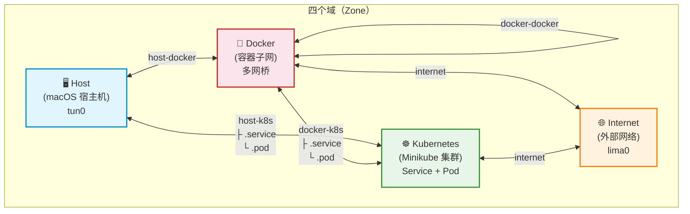
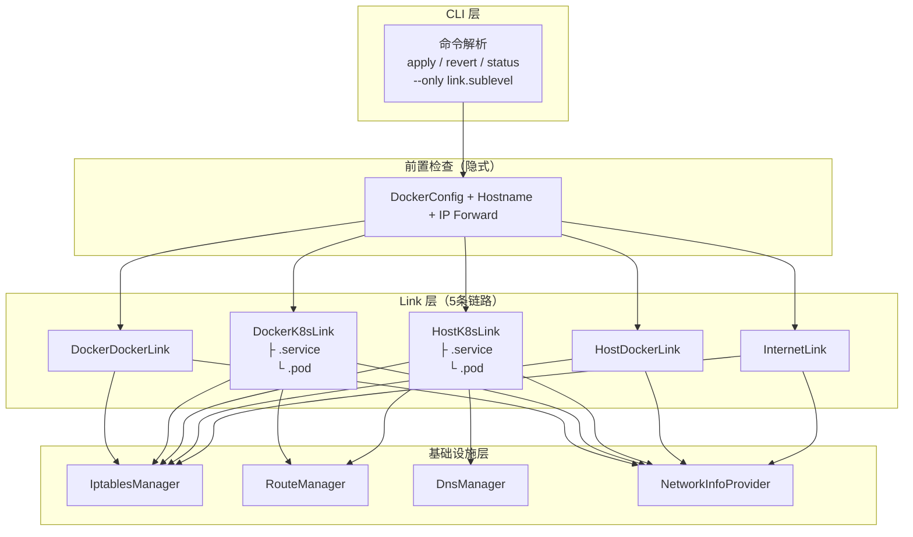

# Zone + Link 网络连通性模型重构

## 需求背景

原有的模块设计（nat、tun0、routes、dns、pod、minikube、bridges）混淆了"底层能力"和"用户场景"。
routes、dns 等底层能力不应作为用户可见模块，用户更关心的是"宿主机能否访问 Pod"这样的场景。

## 核心设计

### 四个域（Zone）



### 五条链路（Link）详细设计

| Link | 子层级 | 含义 | 底层操作 |
|------|--------|------|---------|
| **internet** | — | 所有网桥（含 mk）出外网 | FORWARD bridge↔lima0 + NAT MASQUERADE |
| **host-docker** | — | 宿主机 ↔ 容器 IP | FORWARD tun0↔非mk网桥 |
| **host-k8s** | `.service` | 宿主机 ↔ K8s Service | route(service_cidr) + FORWARD tun0↔mk_bridge + DNS |
| **host-k8s** | `.pod` | 宿主机 ↔ K8s Pod | route(pod_cidr) + FORWARD tun0↔mk_bridge(pod_cidr) |
| **docker-k8s** | `.service` | 容器 ↔ K8s Service | FORWARD 非mk_bridge↔mk_bridge |
| **docker-k8s** | `.pod` | 容器 ↔ K8s Pod | FORWARD 非mk_bridge↔mk_bridge(pod_cidr) |
| **docker-docker** | — | 不同子网容器互通 | FORWARD bridge↔bridge 子网内通信 |

### 前置检查（隐式）

所有 Link 执行前自动运行：
- Docker iptables 配置检查
- hostname 配置检查
- IP forward 开启

### CLI 使用方式

```bash
# 全量操作
./setup-docker-network.py apply                          # 应用所有链路
./setup-docker-network.py revert                         # 还原所有链路（internet 会警告）
./setup-docker-network.py status                         # 查看所有链路状态

# 按链路操作（. 分隔符）
./setup-docker-network.py apply --only internet
./setup-docker-network.py apply --only host-k8s          # service + pod 全部
./setup-docker-network.py apply --only host-k8s.service  # 仅 service
./setup-docker-network.py apply --only host-k8s.pod      # 仅 pod
./setup-docker-network.py apply --only docker-k8s        # service + pod 全部
./setup-docker-network.py apply --only docker-k8s.service
./setup-docker-network.py apply --only docker-k8s.pod
./setup-docker-network.py revert --only docker-k8s
./setup-docker-network.py status --only host-docker

# 多链路
./setup-docker-network.py apply --only internet,host-docker,host-k8s.service
```

### 内部架构



## 实施进展

| 步骤 | 描述 | 状态 |
|------|------|------|
| 1 | 创建需求文档 | ✅ 完成 |
| 2 | 重构基础设施层（DnsManager 提取） | ✅ 完成 |
| 3 | 实现 Link 基类 (AbstractLink) | ✅ 完成 |
| 4 | 实现 InternetLink | ✅ 完成 |
| 5 | 实现 HostDockerLink | ✅ 完成 |
| 6 | 实现 HostK8sLink (含 service/pod 子层级) | ✅ 完成 |
| 7 | 实现 DockerK8sLink (含 service/pod 子层级) | ✅ 完成 |
| 8 | 实现 DockerDockerLink | ✅ 完成 |
| 9 | 重构 CLI 层（argparse + --only 解析 + link 注册表） | ✅ 完成 |
| 10 | 重构 TopologyGenerator 适配新 Link 模型 | ✅ 完成 |
| 11 | 清理旧代码（NetworkConfigurator、StatusViewer 等） | ✅ 完成 |
| 12 | 语法检查 (`python3 -m py_compile`) | ✅ 通过 |

## 新旧对比

| 旧模块 | 新链路 |
|--------|--------|
| `nat` | `internet` |
| `tun0`（非mk部分） | `host-docker` |
| `tun0`(mk) + `routes`(svc) + `dns` | `host-k8s.service` |
| `pod`(tun0→mk) + `routes`(pod) | `host-k8s.pod` |
| `minikube` | `docker-k8s.service` |
| `pod`(bridge→mk) | `docker-k8s.pod` |
| `bridges` | `docker-docker` |
| `docker`、`hostname` | 隐式前置检查 |
| `cleanup`、`topology` | 内置于 apply/status |

## 遗留问题

（暂无）

## 优化记录

### 2026-03-17: 移除 sh 脚本 + 代码精简

**移除**:
- 删除 `scripts/setup-docker-network.sh`（1927 行），只保留 Python 脚本

**代码优化** (1892 → 1821 行，减少 71 行):
- 在 `AbstractLink` 基类新增 `_rules_to_status()` 方法，统一 `_rules()` 和 `status()` 的规则来源
- InternetLink/HostDockerLink/DockerDockerLink/DockerK8sLink 的 `status()` 改为复用 `_rules()` 生成器
- HostK8sLink 新增 `_append_status_check()` 辅助方法，精简路由/DNS 状态检查
- 删除未使用的 `IptablesManager.list_rules_verbose()` 方法
- 删除未使用的 `Config.IPTABLES_TABLES` 常量

**文档更新**:
- README.md: 所有 `.sh` 引用更新为 `.py`，更新自定义配置和快速命令参考
- pod-network-support.md: 所有 `.sh` 引用更新为 `.py`
- zone-link-refactor.md: 新增优化记录
