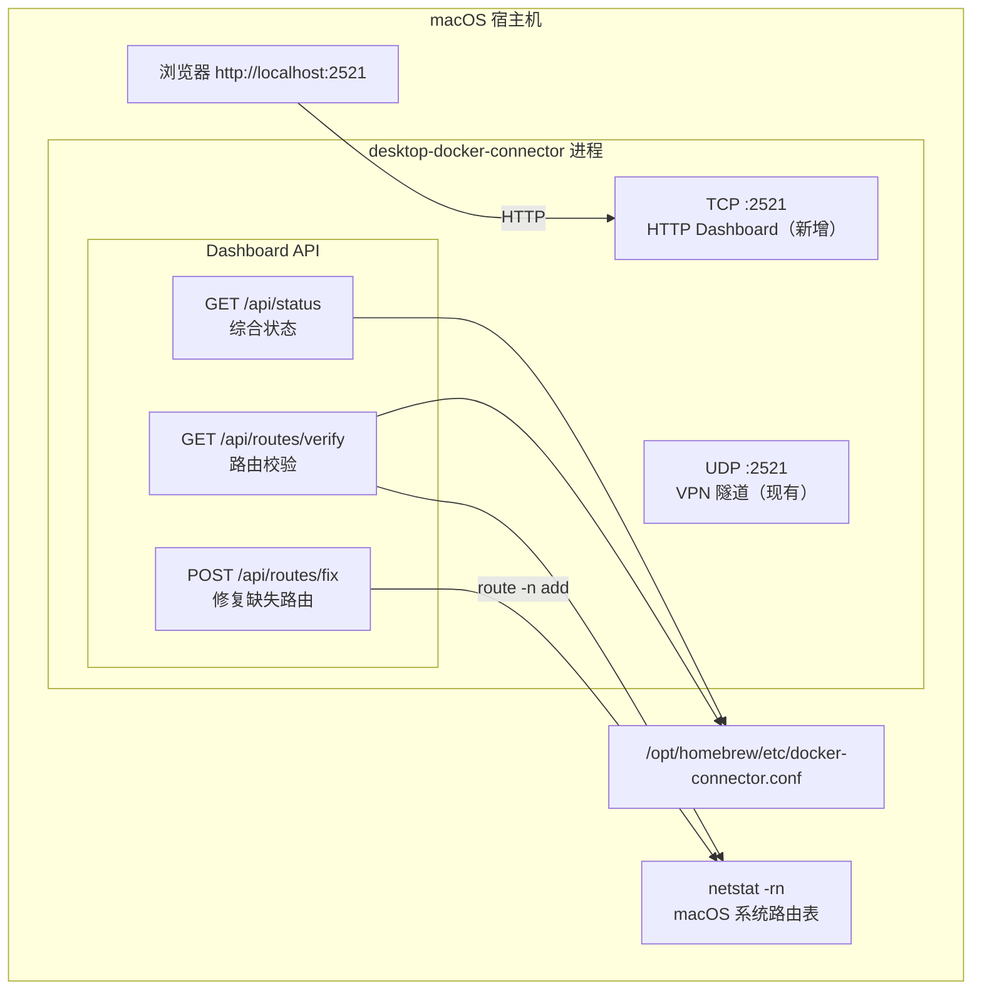
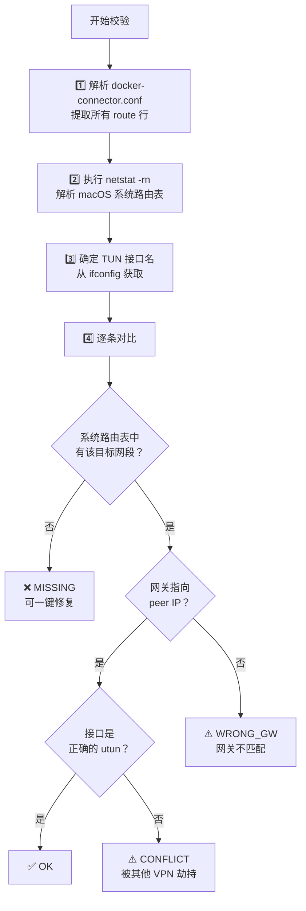
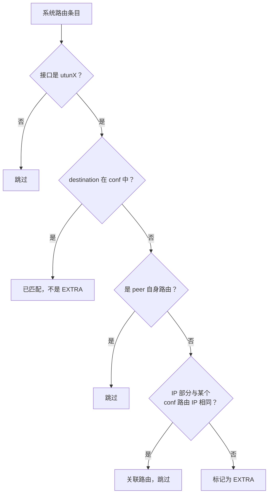
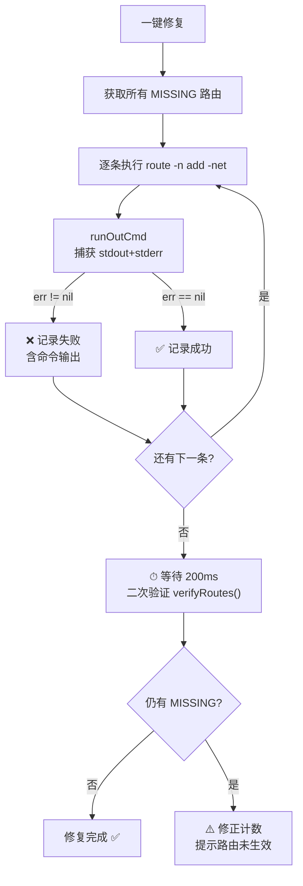
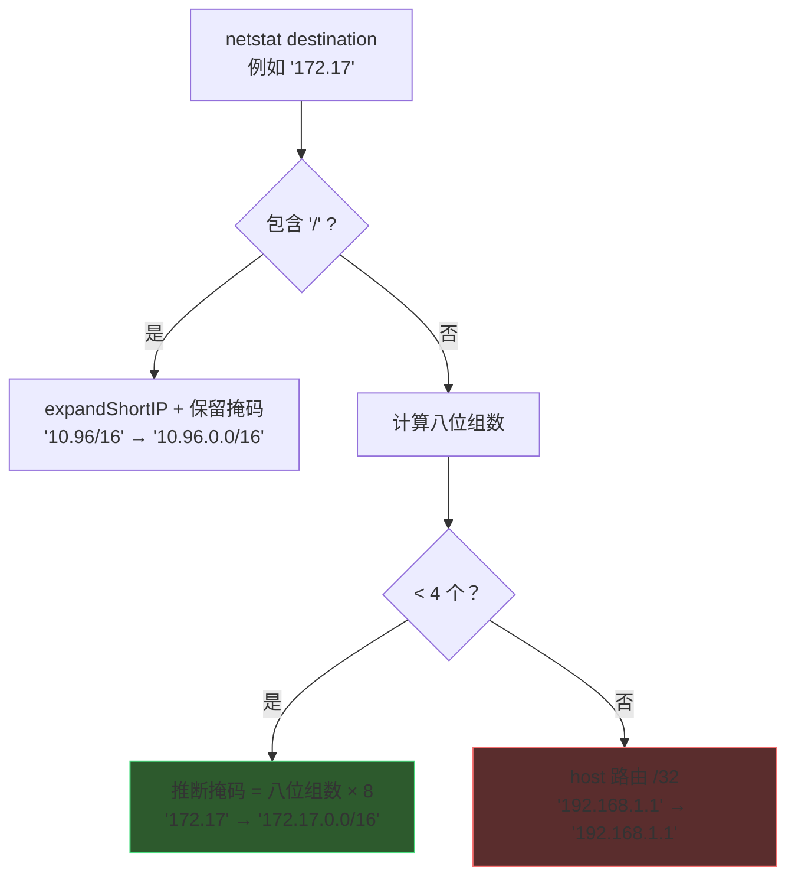

# Web Dashboard 需求文档

## 概述

为 `desktop-docker-connector` 添加内嵌的 Web Dashboard，提供路由校验、一键修复和状态可视化功能。

## 需求背景

当前在 `docker-connector.conf` 中设置 route 后，有时路由未能正确设置到 macOS 系统路由表中，需要手动执行 `route add` 命令。
缺少可视化工具来查看 conf 配置 ↔ 系统路由表 的同步状态。

## 功能范围

| 功能 | 说明 | 状态 |
|------|------|------|
| 路由校验面板 | conf 配置 ↔ 系统路由表交叉对比，标记 OK/MISSING/CONFLICT | Phase 1 |
| 一键修复路由 | 对 MISSING 路由执行 `route -n add` | Phase 1 |
| Connector 状态 | 运行时间、客户端连接、TUN 接口信息 | Phase 1 |
| VM 链路操作 | apply/revert/status（通过 limactl shell） | Phase 2（未实施） |

## 架构



## 端口方案

```
UDP :2521  →  现有 VPN 隧道（不变）
TCP :2521  →  新增 HTTP Dashboard（同端口号，不同协议，互不冲突）
```

## API 设计

| 端点 | 方法 | 描述 |
|------|------|------|
| `GET /` | GET | Dashboard 单页应用 |
| `GET /api/status` | GET | Connector 进程状态（uptime、client、tun 接口） |
| `GET /api/routes/verify` | GET | conf ↔ 系统路由表交叉对比 |
| `POST /api/routes/fix` | POST | 修复所有 MISSING 路由 |

## 路由校验逻辑



## 前端 UI

- **深色主题** + Bento Grid 布局
- **顶部卡片**：Connector 状态（运行时间、TUN 接口、Peer IP、客户端连接）
- **主区域**：路由校验表格（彩色状态标记：🟢 OK / 🔴 MISSING / 🟡 CONFLICT）
- **修复按钮**：检测到 MISSING 时显示"一键修复"按钮
- **自动刷新**：每 5 秒轮询

### Phase 1.5 — 前端优化（无闪烁差量更新）

**问题**：Phase 1 的 `render()` 每次用 `innerHTML` 重建整个 DOM，导致全页面闪烁、动画重播、滚动位置丢失。

**解决方案**：骨架+差量更新架构


**优化项**：

| 优化 | 说明 |
|------|------|
| 差量更新 | DOM 只创建一次骨架，后续只更新变化的 `textContent` |
| 值变化高亮 | 数据变化时蓝色闪烁动画（`valueFlash`） |
| ~~行级过渡~~ | ~~路由表行状态变化时背景渐变闪烁~~ → 已移除，体验不佳 |
| 顶部进度条 | 2px 渐变进度条，指示刷新倒计时 |
| 骨架屏 | 首次加载显示骨架占位，数据到达后平滑切换 |
| 修复结果持久化 | 修复操作结果跨刷新保留 |
| 全部OK庆祝态 | 所有路由正常时显示 ✨ 庆祝横幅 |
| 布局提升 | Hero 卡片突出关键指标 + 次要信息栏 + 更好的视觉层次 |
| 连接状态动画 | 脉冲点 + 断开时红色指示 |

## 新增文件

```
desktop/
├── dashboard.go          # HTTP 路由 + 路由校验逻辑 + 修复路由
├── dashboard_html.go     # 内嵌前端 HTML/CSS/JS（原始字符串）
├── service.go            # 修改：在 run() 中启动 HTTP goroutine
└── ...
```

## 实施进度

| 步骤 | 内容 | 状态 |
|------|------|------|
| 1 | 创建需求文档 | ✅ 完成 |
| 2 | 创建 `dashboard.go` - HTTP 服务 + API (~350行) | ✅ 完成 |
| 3 | 创建 `dashboard_html.go` - 内嵌前端页面 (~280行) | ✅ 完成 |
| 4 | 修改 `service.go` - 启动 HTTP 服务 (2行) | ✅ 完成 |
| 5 | 编译验证 (go build 通过) | ✅ 完成 |
| 6 | **前端优化** - 差量更新 + 骨架屏 + 进度条 + 布局提升 (~500行) | ✅ 完成 |
| 7 | **刷新闪烁修复** - 移除 row-changed 行级闪烁动画 | ✅ 完成 |
| 8 | **EXTRA 路由过滤** - 过滤与 conf 路由 IP 相同但掩码不同的关联路由 | ✅ 完成 |
| 9 | **修复路由增强** - 使用 runOutCmd 捕获命令输出 + 修复后二次验证 | ✅ 完成 |
| 10 | **netstat 缩写掩码推断修复** - 修复 `normalizeNetstatDest` 对无 `/` 缩写 IP 的掩码推断 | ✅ 完成 |

### Phase 1.6 — 刷新体验优化 + EXTRA 路由过滤

**问题 1**：表格每 5 秒刷新时，所有行触发 `row-changed` 闪烁动画，视觉干扰大。
**解决**：移除 `row-changed` CSS 动画和 JS 中的触发逻辑，保留 `value-flash` 值级别高亮。

**问题 2**：conf 配置 `172.17.0.0/16`，但系统路由表中存在 `/8` 或 host 路由 `172.17.0.0`，被标记为 EXTRA 造成视觉混乱。
**解决**：后端增加 `extractIP()` 函数，在标记 EXTRA 前比对 IP 部分，如果与 conf 路由 IP 相同则跳过。



### Phase 1.7 — 修复路由增强（命令输出捕获 + 二次验证）

**问题**：点击一键修复后，显示"成功 9 条，失败 0 条"，但路由仍然为 MISSING。`runCmd` 使用 `cmd.Run()` 不捕获 stderr，无法诊断真实失败原因。

**改进**：

1. **命令输出捕获**：`fixMissingRoutes` 改用 `runOutCmd`（`CombinedOutput`），捕获 stdout + stderr
2. **失败详情展示**：错误信息包含命令实际输出（如 "route: must be root"、"already in table" 等）
3. **二次验证**：修复完成后 200ms，重新执行 `verifyRoutes()` 检查路由是否真正生效
4. **计数修正**：如果命令成功但路由未生效，自动修正 fixed/failed 计数，并附加 ⚠️ 警告提示



### Phase 1.8 — netstat 缩写掩码推断修复

**根因**：`normalizeNetstatDest` 对于 macOS netstat 中无 `/` 后缀的缩写 IP（如 `172.17`）错误地当作 host 路由处理，导致比对时使用 `/32` 掩码，永远无法匹配 conf 中的 `/16` 路由。

**macOS netstat 缩写规则**：省略尾部 `.0` 八位组
- `172.17` = 2 个八位组 → `172.17.0.0/16`
- `10` = 1 个八位组 → `10.0.0.0/8`
- `192.168.1` = 3 个八位组 → `192.168.1.0/24`
- `192.168.1.1` = 4 个八位组 → host 路由 `/32`



**修复前 vs 修复后对比**：

| netstat 输出 | 修复前 (bug) | 修复后 |
|---|---|---|
| `172.17` | `172.17.0.0` → 被当 `/32` → MISSING | `172.17.0.0/16` → 匹配 conf → OK ✅ |
| `192.168.105` | `192.168.105.0` → 被当 `/32` | `192.168.105.0/24` ✅ |
| `127` | `127.0.0.0` → 被当 `/32` | `127.0.0.0/8` ✅ |

## 遗留问题

- [ ] Phase 2: VM 链路操作（limactl shell 调用 Python 脚本的 apply/revert/status）
- [ ] Phase 3: 自动修复 + 定时校验告警
- [ ] Lima VM 名称配置（用于 limactl shell 命令）
- [ ] `--no-dashboard` flag（可选关闭 Dashboard）