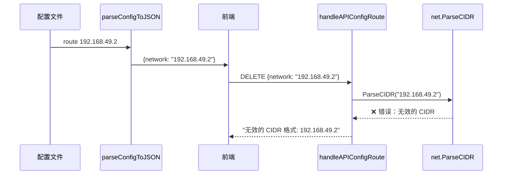
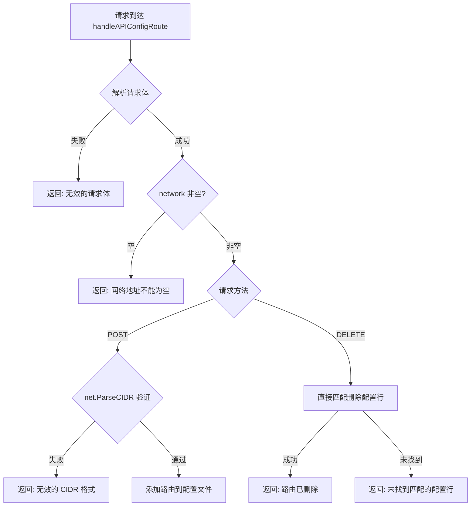

# 修复：删除路由时 CIDR 格式验证报错

## 一、问题描述

在 Dashboard 页面中，点击删除路由按钮时，如果路由地址是纯 IP 格式（如 `192.168.49.2`，不带 `/xx` 掩码后缀），
会报错：`无效的 CIDR 格式: 192.168.49.2`，导致无法删除该路由。

## 二、问题分析

### 根本原因

`handleAPIConfigRoute` 函数中，CIDR 格式验证（`net.ParseCIDR()`）在 POST/DELETE 分支之前执行，
意味着 **所有操作**（包括删除）都要求 network 必须是合法的 CIDR 格式。

但配置文件中的路由可能是不带掩码的纯 IP 地址（如 `route 192.168.49.2`），这是合法的配置格式。
前端从 `parseConfigToJSON()` 拿到的 `network` 字段就是纯 IP 地址，传给 DELETE 时必然验证失败。

### 调用链路



## 三、解决方案

**方案 A（已采用）：DELETE 操作不做 CIDR 验证**

- POST（添加路由）：保留严格的 CIDR 格式验证，防止添加无效路由
- DELETE（删除路由）：不做 CIDR 验证，只验证 network 非空，允许删除任何已存在的配置条目

### 修复后的流程



## 四、实施进展

| 步骤 | 说明 | 状态 |
|------|------|------|
| 1. 修改 handleAPIConfigRoute | CIDR 验证移入 POST 分支，DELETE 跳过验证 | ✅ 完成 |
| 2. 编译验证 | darwin/arm64 + linux/arm64 双端编译通过 | ✅ 完成 |
| 3. 创建需求文档 | 本文档 | ✅ 完成 |

## 五、文件修改范围

| 文件 | 修改内容 |
|------|----------|
| `desktop/dashboard.go` | `handleAPIConfigRoute` 函数：将 CIDR 验证从公共位置移至 POST 分支内部；新增 network 非空检查 |

## 六、具体代码变更

**修改前**：CIDR 验证在 switch 之前执行，POST 和 DELETE 共用
```go
// 验证 CIDR 格式
if _, _, err := net.ParseCIDR(req.Network); err != nil {
    writeJSON(w, map[string]interface{}{"ok": false, "message": ...})
    return
}
switch r.Method {
case "POST":
    // 检查是否已存在
```

**修改后**：增加非空检查，CIDR 验证仅在 POST 时执行
```go
// 验证 network 非空
req.Network = strings.TrimSpace(req.Network)
if req.Network == "" {
    writeJSON(w, map[string]interface{}{"ok": false, "message": "网络地址不能为空"})
    return
}
switch r.Method {
case "POST":
    // 添加路由时严格验证 CIDR 格式
    if _, _, err := net.ParseCIDR(req.Network); err != nil {
        writeJSON(w, map[string]interface{}{"ok": false, "message": ...})
        return
    }
    // 检查是否已存在
```

## 七、遗留问题

无。
