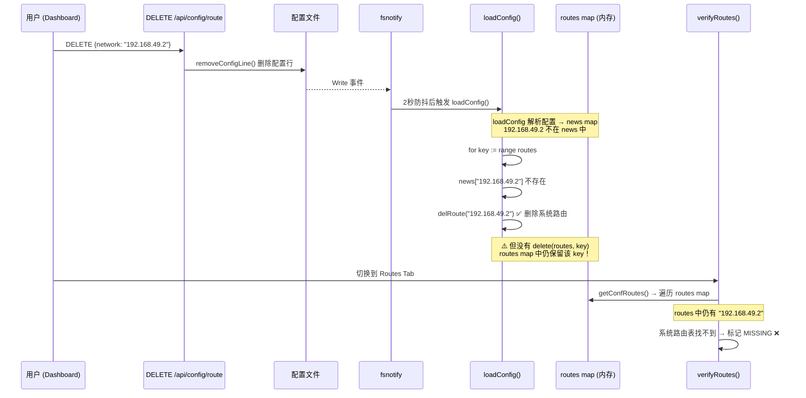

# Fix: 删除路由后 routes map 内存未清理导致 MISSING 幽灵路由

## 一、问题描述

在 Dashboard Configuration Tab 中删除一条路由后（例如 `192.168.49.2`），切换到 Routes Tab 查看时，该路由仍然显示且状态为 **MISSING**。

### 现象

- 配置文件中已删除 `route 192.168.49.2` 行 ✅
- 系统路由表中已删除对应的系统路由 ✅
- 但 Routes Tab 仍然显示 `192.168.49.2` 且状态为 MISSING ❌

## 二、根因分析

### 调用链路



### 根本原因

`loadConfig()` 函数在热加载配置时，对于不再存在于配置文件中的路由：

**修复前（Bug）：**
```go
for key := range routes {
    if val, ok := news[key]; ok {
        routes[key] = val      // 还在配置中 → 更新
        delete(news, key)
    } else if bind {
        delRoute(key)          // 不在配置中 → 只删了系统路由
    }
    // ❌ 缺少 delete(routes, key)
}
```

- ✅ 系统路由表已删除（`delRoute`）
- ❌ 内存 `routes` map 未清理

### 影响范围

- `getConfRoutes()` 读取 `routes` map → `verifyRoutes()` 误认为该路由仍应存在 → 标记 MISSING
- `discoverDockerSubnets()` 中 `routes[s.Network]` 的 added 判断也会受影响

## 三、解决方案

在遍历 `routes` 时，收集需要删除的 key 到 `delKeys` 切片，循环外统一 `delete(routes, key)`。

> 注意：Go 语言中 `for range` 遍历 map 时直接 delete 虽然不会 panic，
> 但可能导致部分 key 被跳过。使用先收集后删除的模式更安全。

**修复后：**
```go
var delKeys []string
for key := range routes {
    if val, ok := news[key]; ok {
        routes[key] = val
        delete(news, key)
    } else {
        delKeys = append(delKeys, key)
        if bind {
            delRoute(key)
        }
    }
}
for _, key := range delKeys {
    delete(routes, key)
}
```

## 四、修改文件

| 文件 | 修改内容 |
|------|----------|
| `desktop/config.go` | `loadConfig()` 函数：添加 `delKeys` 收集待删除路由 key，循环外统一从 `routes` map 中移除 |

## 五、实施进展

| 步骤 | 说明 | 状态 |
|------|------|------|
| 1. 分析根因 | 确认 routes map 未清理是 bug 根因 | ✅ 完成 |
| 2. 修改 loadConfig | 添加 delKeys 收集 + 循环外 delete | ✅ 完成 |
| 3. 编译验证 | Desktop (darwin/arm64) + Docker (linux/arm64) | ✅ 通过 |

## 六、遗留问题

无。
