# Phase 2：VM 链路管理集成 — 完整实施方案

## 一、概述

将 `setup-docker-network.py` 的 5 条链路管理能力用 Go 重写，集成到 `docker-connector` 的同一个二进制中，部署为 Lima VM 中的 **Linux 原生 systemd 服务**。通过 **HTTP 反向代理** 将 VM 链路 API 暴露给 macOS Dashboard，同时对现有 **UDP VPN 隧道**进行传输效率优化。

## 二、核心设计决策

### 2.1 为什么选择 Linux 服务而非容器

经过多轮讨论，容器模式存在 3 个根本性障碍：

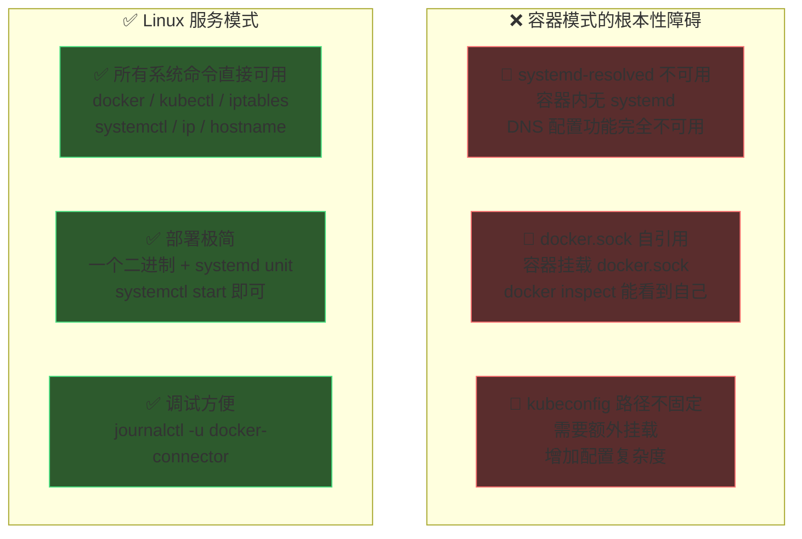
```mermaid
graph TB
    subgraph "❌ 容器模式的根本性障碍"
        P1["🔴 systemd-resolved 不可用<br/>容器内无 systemd<br/>DNS 配置功能完全不可用"]
        P2["🔴 docker.sock 自引用<br/>容器挂载 docker.sock<br/>docker inspect 能看到自己"]
        P3["🔴 kubeconfig 路径不固定<br/>需要额外挂载<br/>增加配置复杂度"]
    end

    subgraph "✅ Linux 服务模式"
        S1["✅ 所有系统命令直接可用<br/>docker / kubectl / iptables<br/>systemctl / ip / hostname"]
        S2["✅ 部署极简<br/>一个二进制 + systemd unit<br/>systemctl start 即可"]
        S3["✅ 调试方便<br/>journalctl -u docker-connector"]
    end

    style P1 fill:#5a2d2d,stroke:#f87171
    style P2 fill:#5a2d2d,stroke:#f87171
    style P3 fill:#5a2d2d,stroke:#f87171
    style S1 fill:#2d5a2d,stroke:#4ade80
    style S2 fill:#2d5a2d,stroke:#4ade80
    style S3 fill:#2d5a2d,stroke:#4ade80
```

| 维度 | 容器模式 | Linux 服务模式 |
|------|---------|---------------|
| systemd-resolved DNS | ❌ 不可能 | ✅ 直接操作 |
| docker.sock 自引用 | ⚠️ 需 workaround | ✅ 无此问题 |
| kubeconfig 挂载 | ⚠️ 路径不固定 | ✅ 直接可用 |
| iptables / ip route | 🟡 需 NET_ADMIN + host 网络 | ✅ root 直接操作 |
| 部署命令 | `docker run` 带 6-7 个参数 | `systemctl start` |
| 调试 | `docker exec` 进容器 | `journalctl` |

### 2.2 为什么用 HTTP 反向代理而非 UDP 双向协议扩展

原始方案是在 UDP 隧道上扩展 `data[0]=2` 请求包和 `data[0]=3` 响应包。但分析后发现：

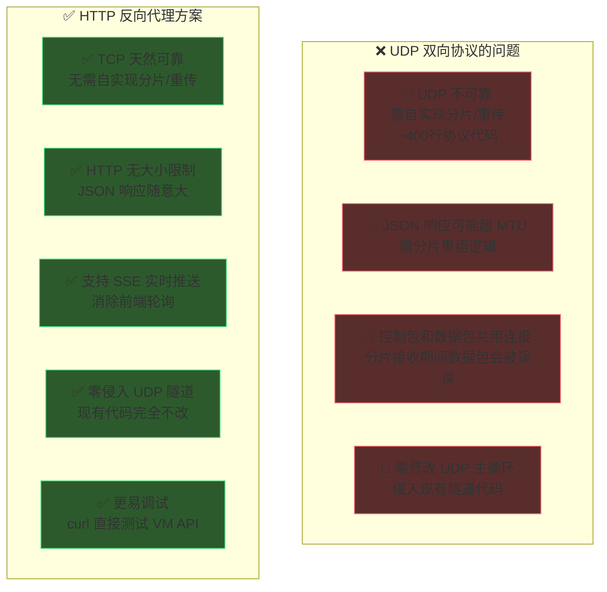
```mermaid
graph TB
    subgraph "❌ UDP 双向协议的问题"
        A1["🔴 UDP 不可靠<br/>需自实现分片/重传<br/>~400行协议代码"]
        A2["🔴 JSON 响应可能超 MTU<br/>需分片重组逻辑"]
        A3["🔴 控制包和数据包共用连接<br/>分片接收期间数据包会被误读"]
        A4["🔴 需修改 UDP 主循环<br/>侵入现有隧道代码"]
    end

    subgraph "✅ HTTP 反向代理方案"
        B1["✅ TCP 天然可靠<br/>无需自实现分片/重传"]
        B2["✅ HTTP 无大小限制<br/>JSON 响应随意大"]
        B3["✅ 支持 SSE 实时推送<br/>消除前端轮询"]
        B4["✅ 零侵入 UDP 隧道<br/>现有代码完全不改"]
        B5["✅ 更易调试<br/>curl 直接测试 VM API"]
    end

    style A1 fill:#5a2d2d,stroke:#f87171
    style A2 fill:#5a2d2d,stroke:#f87171
    style A3 fill:#5a2d2d,stroke:#f87171
    style A4 fill:#5a2d2d,stroke:#f87171
    style B1 fill:#2d5a2d,stroke:#4ade80
    style B2 fill:#2d5a2d,stroke:#4ade80
    style B3 fill:#2d5a2d,stroke:#4ade80
    style B4 fill:#2d5a2d,stroke:#4ade80
    style B5 fill:#2d5a2d,stroke:#4ade80
```

| 维度 | UDP 双向协议 | HTTP 反向代理 |
|------|-------------|--------------|
| 可靠性 | ❌ 需自实现分片/重传 | ✅ TCP 天然保证 |
| 大包传输 | ❌ 需 MTU 分片 | ✅ 无限制 |
| 实时推送 | ❌ 只能轮询 | ✅ SSE 推送 |
| 协议代码量 | ~400 行 (rpc_handler + rpc_client) | ~80 行 (httputil.ReverseProxy) |
| UDP 隧道改动 | 需改 (新增 data[0]=2/3) | **零改动** |
| 调试友好 | 差 (二进制 UDP 包) | ✅ curl 直接测试 |
| 代码量差异 | ~1910 行 | **~1640 行 (减少 270 行)** |

## 三、整体架构


```mermaid
graph TB
    subgraph "macOS 宿主机"
        Browser["🌐 浏览器<br/>http://localhost:2521"]

        subgraph "desktop-docker-connector (macOS 进程)"
            UDP_D["UDP :2521<br/>VPN 隧道（不变）"]
            HTTP_D["TCP :2521<br/>HTTP Dashboard"]

            subgraph "Dashboard API 路由"
                LOCAL["Phase 1 API (本地处理)<br/>GET /api/status<br/>GET /api/routes/verify<br/>POST /api/routes/fix"]
                PROXY["Phase 2 API (反向代理)<br/>GET /api/vm/*<br/>→ http://peerIP:2522/api/*"]
            end
        end

        ConfFile["docker-connector.conf"]
        SysRoute["netstat -rn"]
    end

    subgraph "Lima VM (Linux)"
        subgraph "docker-connector 服务 (systemd)"
            TUN["TUN 隧道<br/>(现有 main.go，不变)"]
            HTTP_VM["HTTP :2522<br/>(绑定 peer IP，仅内网可见)"]

            subgraph "Link API"
                API_LINKS["GET /api/links<br/>GET /api/links/stream (SSE)"]
                API_APPLY["POST /api/apply"]
                API_REVERT["POST /api/revert"]
                API_INFO["GET /api/network/info"]
            end

            subgraph "Link Manager (Go 重写 Python)"
                LM["LinkManager<br/>+ 缓存(5s)"]
                LI["InternetLink"]
                LHD["HostDockerLink"]
                LHK["HostK8sLink<br/>├ .service<br/>└ .pod"]
                LDK["DockerK8sLink<br/>├ .service<br/>└ .pod"]
                LDD["DockerDockerLink"]
            end

            subgraph "基础设施层"
                IPT["IptablesManager"]
                NET["NetworkInfoProvider<br/>(docker CLI)"]
                ROUTE["RouteManager<br/>(ip route)"]
                DNS_M["DnsManager<br/>(systemd-resolved)"]
                CMD["CommandExecutor"]
            end
        end

        DOCKER["Docker Daemon"]
        K8S["Minikube / K8s"]
    end

    Browser -->|HTTP| HTTP_D
    LOCAL --> ConfFile & SysRoute
    PROXY -->|"反向代理<br/>走 TUN 隧道<br/>延迟 < 1ms"| HTTP_VM
    HTTP_VM --> API_LINKS & API_APPLY & API_REVERT & API_INFO
    API_LINKS & API_APPLY & API_REVERT --> LM
    LM --> LI & LHD & LHK & LDK & LDD
    LI & LHD & LDD --> IPT & NET
    LHK --> IPT & ROUTE & DNS_M & NET
    LDK --> IPT & ROUTE & NET
    NET --> DOCKER
    LHK --> K8S
    API_INFO --> NET

    UDP_D <-->|"UDP 隧道 (完全不变)"| TUN

    style HTTP_VM fill:#2d5a2d,stroke:#4ade80
    style PROXY fill:#5a3a5a,stroke:#c084fc
    style LM fill:#3a4a1e,stroke:#a3e635
    style TUN fill:#1e3a5f,stroke:#60a5fa
```

### 3.1 通信流程

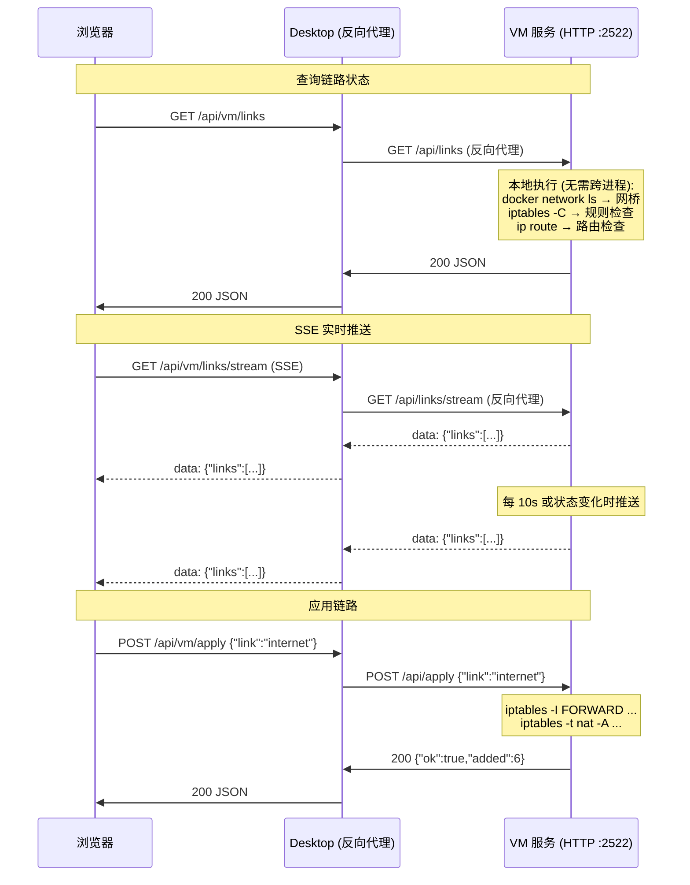
```mermaid
sequenceDiagram
    participant B as 浏览器
    participant D as Desktop (反向代理)
    participant V as VM 服务 (HTTP :2522)

    Note over B,V: 查询链路状态
    B->>D: GET /api/vm/links
    D->>V: GET /api/links (反向代理)
    Note over V: 本地执行 (无需跨进程):<br/>docker network ls → 网桥<br/>iptables -C → 规则检查<br/>ip route → 路由检查
    V->>D: 200 JSON
    D->>B: 200 JSON

    Note over B,V: SSE 实时推送
    B->>D: GET /api/vm/links/stream (SSE)
    D->>V: GET /api/links/stream (反向代理)
    V-->>D: data: {"links":[...]}
    D-->>B: data: {"links":[...]}
    Note over V: 每 10s 或状态变化时推送
    V-->>D: data: {"links":[...]}
    D-->>B: data: {"links":[...]}

    Note over B,V: 应用链路
    B->>D: POST /api/vm/apply {"link":"internet"}
    D->>V: POST /api/apply {"link":"internet"}
    Note over V: iptables -I FORWARD ...<br/>iptables -t nat -A ...
    V->>D: 200 {"ok":true,"added":6}
    D->>B: 200 JSON
```

### 3.2 VM 端缓存策略

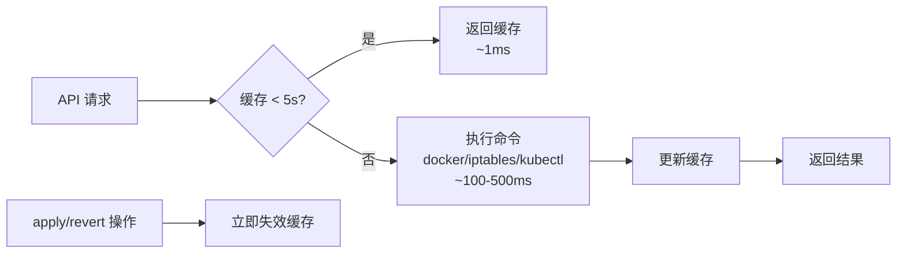
```mermaid
flowchart LR
    REQ["API 请求"] --> CACHE{"缓存 < 5s?"}
    CACHE -->|是| HIT["返回缓存<br/>~1ms"]
    CACHE -->|否| EXEC["执行命令<br/>docker/iptables/kubectl<br/>~100-500ms"]
    EXEC --> UPDATE["更新缓存"]
    UPDATE --> RETURN["返回结果"]

    APPLY["apply/revert 操作"] --> INVALIDATE["立即失效缓存"]
```

## 四、UDP 隧道传输效率优化

现有 UDP VPN 隧道在数据传输效率上存在以下可优化点：

### 4.1 问题分析

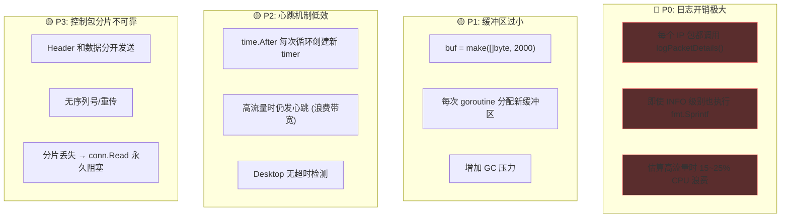
```mermaid
graph TB
    subgraph "🔴 P0: 日志开销极大"
        L1["每个 IP 包都调用 logPacketDetails()"]
        L2["即使 INFO 级别也执行 fmt.Sprintf"]
        L3["估算高流量时 15~25% CPU 浪费"]
    end

    subgraph "🟡 P1: 缓冲区过小"
        B1["buf = make([]byte, 2000)"]
        B2["每次 goroutine 分配新缓冲区"]
        B3["增加 GC 压力"]
    end

    subgraph "🟡 P2: 心跳机制低效"
        H1["time.After 每次循环创建新 timer"]
        H2["高流量时仍发心跳 (浪费带宽)"]
        H3["Desktop 无超时检测"]
    end

    subgraph "🟡 P3: 控制包分片不可靠"
        C1["Header 和数据分开发送"]
        C2["无序列号/重传"]
        C3["分片丢失 → conn.Read 永久阻塞"]
    end

    style L1 fill:#5a2d2d,stroke:#f87171
    style L2 fill:#5a2d2d,stroke:#f87171
    style L3 fill:#5a2d2d,stroke:#f87171
```

### 4.2 优化方案

| 优先级 | 优化项 | 改动量 | 收益 | 说明 |
|--------|--------|--------|------|------|
| **P0** | 日志守卫 | ~10 行 | ⭐⭐⭐⭐⭐ | 加 if 级别检查，跳过无效的 fmt.Sprintf |
| **P1** | 缓冲区 65535 + sync.Pool | ~20 行 | ⭐⭐⭐⭐ | 复用缓冲区，减少 GC 80% |
| **P2** | 智能心跳 (Ticker + 活性感知) | ~30 行 | ⭐⭐⭐ | 有数据流时跳过心跳，Desktop 增加超时检测 |
| **P2** | 控制包合并发送 | ~20 行 | ⭐⭐⭐ | header + data 合一个 UDP 包避免丢失 |
| **P3** | 控制包分片超时 | ~15 行 | ⭐⭐ | 避免 conn.Read 永久阻塞 |
| **P4** | 控制包 ACK/重传 | ~80 行 | ⭐⭐ | 按需，增加复杂度 |
| **P5** | 并发 Pipeline | ~100 行 | ⭐⭐ | 暂缓，当前流量不需要 |


```mermaid
quadrantChart
    title UDP 优化投入产出比
    x-axis 改动量小 --> 改动量大
    y-axis 收益低 --> 收益高
    quadrant-1 重点优化
    quadrant-2 视需要
    quadrant-3 暂缓
    quadrant-4 先做
    日志守卫: [0.15, 0.9]
    缓冲区Pool: [0.25, 0.6]
    智能心跳: [0.35, 0.45]
    控制包合并: [0.55, 0.5]
    控制包ACK: [0.8, 0.55]
    并发Pipeline: [0.85, 0.7]
```

#### P0: 日志守卫（改动极小，收益极大）

```go
// 优化前 - 每个包都调用，即使 INFO 级别
logPacketDetails(buf, n, "TUN->UDP")

// 优化后 - 前置日志级别检查
if logger.IsEnabledFor(logging.DEBUG) {
    logPacketDetails(buf, n, "TUN->UDP")
}

// 进一步优化 - 高流量时采样
var packetCount uint64
func logPacketSampled(data []byte, n int, dir string) {
    count := atomic.AddUint64(&packetCount, 1)
    if count % 1000 == 0 {
        logPacketDetails(data, n, dir)
    }
}
```

#### P1: 缓冲区 + sync.Pool

```go
// 优化前
buf := make([]byte, 2000)

// 优化后
var bufPool = sync.Pool{
    New: func() interface{} {
        b := make([]byte, 65535)
        return &b
    },
}
bufPtr := bufPool.Get().(*[]byte)
buf := *bufPtr
defer bufPool.Put(bufPtr)
```

#### P2: 智能心跳

```go
// 优化前 - time.After 每次循环创建新 timer
case <-time.After(duration):
    conn.Write([]byte{0})

// 优化后 - Ticker + 数据流感知
ticker := time.NewTicker(duration)
defer ticker.Stop()
var lastActivity int64 = time.Now().UnixNano()

go func() {
    for range ticker.C {
        if time.Since(time.Unix(0, atomic.LoadInt64(&lastActivity))) > duration {
            conn.Write([]byte{0})
        }
    }
}()
```

### 4.3 预期效果

| 指标 | 优化前 | 优化后 (P0+P1+P2) | 提升 |
|------|--------|-------------------|------|
| 包处理吞吐量 | ~50K pps | ~80K+ pps | **+60%** |
| per-packet CPU (INFO 级别) | ~8µs | ~2µs | **-75%** |
| GC 停顿 | 偶尔 5~10ms | <1ms | **-90%** |
| 心跳额外带宽 (高流量) | 持续发送 | 自动跳过 | **-100%** |
| 内存分配频率 | 每 goroutine 启动 | Pool 复用 | **显著降低** |

## 五、完整 Roadmap

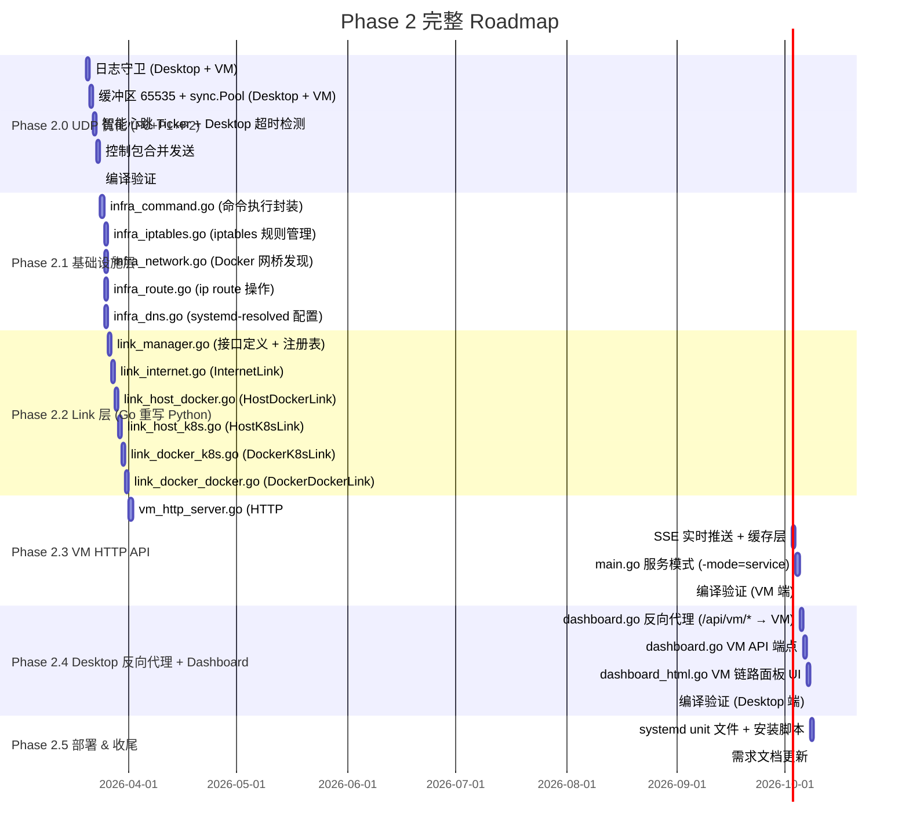
```mermaid
gantt
    title Phase 2 完整 Roadmap
    dateFormat  YYYY-MM-DD

    section Phase 2.0 UDP 优化 (P0+P1+P2)
    日志守卫 (Desktop + VM)                      :udp1, 2026-03-20, 0.5d
    缓冲区 65535 + sync.Pool (Desktop + VM)       :udp2, after udp1, 0.5d
    智能心跳 Ticker + Desktop 超时检测             :udp3, after udp2, 0.5d
    控制包合并发送                                 :udp4, after udp3, 0.5d
    编译验证                                       :udp5, after udp4, 0.25d

    section Phase 2.1 基础设施层
    infra_command.go (命令执行封装)                :inf1, after udp5, 0.5d
    infra_iptables.go (iptables 规则管理)          :inf2, after inf1, 1d
    infra_network.go (Docker 网桥发现)             :inf3, after inf1, 1d
    infra_route.go (ip route 操作)                 :inf4, after inf1, 0.5d
    infra_dns.go (systemd-resolved 配置)           :inf5, after inf1, 0.5d

    section Phase 2.2 Link 层 (Go 重写 Python)
    link_manager.go (接口定义 + 注册表)            :lnk1, after inf2, 0.5d
    link_internet.go (InternetLink)                :lnk2, after lnk1, 0.5d
    link_host_docker.go (HostDockerLink)           :lnk3, after lnk2, 0.5d
    link_host_k8s.go (HostK8sLink)                 :lnk4, after lnk3, 1d
    link_docker_k8s.go (DockerK8sLink)             :lnk5, after lnk4, 0.5d
    link_docker_docker.go (DockerDockerLink)        :lnk6, after lnk5, 0.5d

    section Phase 2.3 VM HTTP API
    vm_http_server.go (HTTP :2522 + API 路由)      :api1, after lnk6, 0.5d
    SSE 实时推送 + 缓存层                          :api2, after api1, 0.5d
    main.go 服务模式 (-mode=service)               :api3, after api2, 0.5d
    编译验证 (VM 端)                               :api4, after api3, 0.25d

    section Phase 2.4 Desktop 反向代理 + Dashboard
    dashboard.go 反向代理 (/api/vm/* → VM)         :dsk1, after api4, 0.5d
    dashboard.go VM API 端点                       :dsk2, after dsk1, 0.5d
    dashboard_html.go VM 链路面板 UI               :dsk3, after dsk2, 1d
    编译验证 (Desktop 端)                          :dsk4, after dsk3, 0.25d

    section Phase 2.5 部署 & 收尾
    systemd unit 文件 + 安装脚本                   :dep1, after dsk4, 0.5d
    需求文档更新                                   :dep2, after dep1, 0.25d
```

## 六、详细实施步骤

### Phase 2.0 — UDP 隧道传输效率优化

**目标**：在不改变协议的前提下，通过 ~60 行改动提升 60%+ 吞吐量

| 步骤 | 文件 | 改动 | 说明 |
|------|------|------|------|
| 2.0.1 | `desktop/service.go` | 日志守卫 | `logPacketDetails` 前加 `if logger.IsEnabledFor(DEBUG)` |
| 2.0.2 | `docker/main.go` | 日志守卫 | 同上 |
| 2.0.3 | `desktop/service.go` | 缓冲区 65535 + sync.Pool | `buf := make([]byte, 2000)` → Pool |
| 2.0.4 | `docker/main.go` | 缓冲区 65535 + sync.Pool | 同上 |
| 2.0.5 | `docker/main.go` | 智能心跳 | `time.After` → `time.NewTicker` + 活性感知 |
| 2.0.6 | `desktop/service.go` | 心跳超时检测 | 15s 无心跳告警 |
| 2.0.7 | `desktop/config.go` | 控制包合并发送 | header + data 合一个 UDP 包 |
| 2.0.8 | `docker/main.go` | 控制包分片超时 | 500ms 超时避免永久阻塞 |
| 2.0.9 | 两端 | 编译验证 | `go build` |

### Phase 2.1 — 基础设施层

**目标**：Go 实现系统命令封装，为 Link 层提供基础能力

| 步骤 | 新文件 | 行数 | 核心函数/类型 |
|------|--------|------|-------------|
| 2.1.1 | `docker/infra_command.go` | ~50 | `runCommand()`, `runCommandSudo()`, `commandExists()` |
| 2.1.2 | `docker/infra_iptables.go` | ~150 | `IptablesRule`, `IptablesManager`, `AddRule()`, `DeleteRule()`, `CheckRule()`, `Commit()` |
| 2.1.3 | `docker/infra_network.go` | ~200 | `BridgeInfo`, `MinikubeInfo`, `NetworkInfoProvider`, `GetBridges()`, `GetMinikubeInfo()`, `GetExternalInterface()` |
| 2.1.4 | `docker/infra_route.go` | ~60 | `addRoute()`, `deleteRoute()`, `routeExists()` |
| 2.1.5 | `docker/infra_dns.go` | ~80 | `configureDNS()`, `removeDNS()`, `isDNSConfigured()` |

### Phase 2.2 — Link 层 (Go 重写 Python)

**目标**：将 `setup-docker-network.py` 的 5 条链路用 Go 实现

| 步骤 | 新文件 | 行数 | 对应 Python 类 | 核心操作 |
|------|--------|------|---------------|---------|
| 2.2.1 | `docker/link_manager.go` | ~120 | — | `Link` 接口, `LinkStatus`, `LinkManager` 注册表 |
| 2.2.2 | `docker/link_internet.go` | ~100 | `InternetLink` | FORWARD bridge↔外网 + NAT MASQUERADE |
| 2.2.3 | `docker/link_host_docker.go` | ~80 | `HostDockerLink` | FORWARD tun0↔非mk网桥 |
| 2.2.4 | `docker/link_host_k8s.go` | ~150 | `HostK8sLink` | route + FORWARD tun0↔mk + DNS |
| 2.2.5 | `docker/link_docker_k8s.go` | ~100 | `DockerK8sLink` | FORWARD 非mk↔mk |
| 2.2.6 | `docker/link_docker_docker.go` | ~80 | `DockerDockerLink` | FORWARD bridge↔bridge |

**Link 接口定义**：

```go
type Link interface {
    Name() string
    SubLevels() []string        // ["service", "pod"] 或 nil
    Apply(subLevel string) error
    Revert(subLevel string) error
    Status(subLevel string) (*LinkStatus, error)
}

type LinkStatus struct {
    Name        string       `json:"name"`
    Status      string       `json:"status"`      // "active" / "partial" / "inactive"
    RulesActive int          `json:"rules_active"`
    RulesTotal  int          `json:"rules_total"`
    Details     []RuleDetail `json:"details"`
}
```

### Phase 2.3 — VM HTTP API

**目标**：VM 服务内嵌轻量 HTTP 服务，绑定 peer IP，仅内网可见

| 步骤 | 文件 | 行数 | 说明 |
|------|------|------|------|
| 2.3.1 | `docker/vm_http_server.go` (新) | ~120 | HTTP :2522 服务 + API 路由 |
| 2.3.2 | `docker/vm_http_server.go` | +50 | SSE `/api/links/stream` + 缓存层 |
| 2.3.3 | `docker/main.go` (改) | +40 | `-mode=service` flag + LinkManager 初始化 |

**VM API 端点**：

| 端点 | 方法 | 说明 |
|------|------|------|
| `GET /api/links` | GET | 获取所有链路状态 (JSON) |
| `GET /api/links/stream` | GET | SSE 实时推送链路状态 |
| `POST /api/apply` | POST | 应用指定链路 `{"link":"internet"}` |
| `POST /api/revert` | POST | 还原指定链路 `{"link":"internet"}` |
| `GET /api/network/info` | GET | 获取网络信息（网桥、Minikube） |

### Phase 2.4 — Desktop 反向代理 + Dashboard

**目标**：Desktop 将 `/api/vm/*` 请求反向代理到 VM HTTP 服务

| 步骤 | 文件 | 行数 | 说明 |
|------|------|------|------|
| 2.4.1 | `desktop/dashboard.go` (改) | +30 | `httputil.ReverseProxy` 反向代理 `/api/vm/*` → `http://peerIP:2522/api/*` |
| 2.4.2 | `desktop/dashboard.go` (改) | +50 | 新增 VM 链路 API 端点封装 |
| 2.4.3 | `desktop/dashboard_html.go` (改) | +300 | VM 链路面板 UI（状态卡片、Apply/Revert 按钮、规则详情） |

**反向代理核心代码**：

```go
// 约 30 行即可实现
vmProxy := &httputil.ReverseProxy{
    Director: func(req *http.Request) {
        req.URL.Scheme = "http"
        req.URL.Host = fmt.Sprintf("%s:2522", peerIP)
        // /api/vm/links → /api/links（替换前缀 /api/vm → /api）
        req.URL.Path = strings.Replace(req.URL.Path, "/api/vm", "/api", 1)
    },
}
mux.Handle("/api/vm/", vmProxy)
```

### Phase 2.5 — 部署 & 收尾

| 步骤 | 文件 | 说明 |
|------|------|------|
| 2.5.1 | `deploy/docker-connector.service` (新) | systemd unit 文件 |
| 2.5.2 | `deploy/install.sh` (新) | Lima VM 一键安装脚本 |
| 2.5.3 | `docs/phase2-vm-link-management.md` | 更新实施进度 |

**systemd unit 文件**：

```ini
[Unit]
Description=Docker Connector Service
After=network.target docker.service
Wants=docker.service

[Service]
Type=simple
ExecStart=/usr/local/bin/docker-connector \
    -mode=service \
    -port=2521 \
    -addr=PEER_IP/24
Restart=always
RestartSec=5

[Install]
WantedBy=multi-user.target
```

## 七、文件变更清单

### 新增文件

| 文件 | 位置 | 行数 | 说明 |
|------|------|------|------|
| `infra_command.go` | docker/ | ~50 | 命令执行封装 |
| `infra_iptables.go` | docker/ | ~150 | iptables 管理 |
| `infra_network.go` | docker/ | ~200 | Docker 网桥发现 |
| `infra_route.go` | docker/ | ~60 | ip route 操作 |
| `infra_dns.go` | docker/ | ~80 | DNS 配置 |
| `link_manager.go` | docker/ | ~120 | Link 接口 + 注册表 |
| `link_internet.go` | docker/ | ~100 | InternetLink |
| `link_host_docker.go` | docker/ | ~80 | HostDockerLink |
| `link_host_k8s.go` | docker/ | ~150 | HostK8sLink |
| `link_docker_k8s.go` | docker/ | ~100 | DockerK8sLink |
| `link_docker_docker.go` | docker/ | ~80 | DockerDockerLink |
| `vm_http_server.go` | docker/ | ~170 | VM HTTP API + SSE |
| `docker-connector.service` | deploy/ | ~20 | systemd unit |
| `install.sh` | deploy/ | ~30 | 安装脚本 |
| **小计** | | **~1390** | |

### 修改文件

| 文件 | 位置 | 改动量 | 说明 |
|------|------|--------|------|
| `main.go` | docker/ | ~40 行 | -mode flag + LinkManager 初始化 |
| `service.go` | desktop/ | ~20 行 | 日志守卫 + 缓冲区优化 + 心跳超时 |
| `config.go` | desktop/ | ~15 行 | 控制包合并发送 |
| `dashboard.go` | desktop/ | ~80 行 | 反向代理 + VM API 端点 |
| `dashboard_html.go` | desktop/ | ~300 行 | VM 链路面板 UI |
| **小计** | | **~455** | |

### 总计

| 类型 | 代码量 |
|------|--------|
| 新增 | ~1390 行 Go + ~30 行 Shell |
| 修改 | ~455 行 Go (含 ~300 行 HTML/JS) |
| **总计** | **~1875 行** |

## 八、向后兼容策略


```mermaid
graph LR
    subgraph "运行模式"
        C["-mode=container (默认)"]
        S["-mode=service"]
    end

    C --> C1["仅 TUN 隧道 + 心跳<br/>+ 现有控制协议<br/>(与当前完全一致)"]
    S --> S1["TUN 隧道 + 心跳<br/>+ 现有控制协议<br/>+ Link 管理<br/>+ HTTP API :2522"]

    style C fill:#1e3a5f,stroke:#60a5fa
    style S fill:#2d5a2d,stroke:#4ade80
```

- **容器模式** `-mode=container`：行为完全不变，向后兼容
- **服务模式** `-mode=service`：启用全部新功能 (Link 管理 + HTTP API)
- **Desktop 端**：自动探测 VM HTTP 端口是否可达，不可达则 VM 面板置灰显示"需要升级 VM 端"

## 九、实施进度

| Phase | 步骤 | 内容 | 状态 |
|-------|------|------|------|
| **2.0** | 2.0.1 | 日志守卫 (Desktop + VM) | ✅ 完成 |
| | 2.0.2 | 缓冲区 65535 + sync.Pool | ✅ 完成 |
| | 2.0.3 | 智能心跳 + Desktop 超时检测 | ✅ 完成 |
| | 2.0.4 | 控制包合并发送 + 分片超时 | ✅ 完成 |
| | 2.0.5 | 编译验证 | ✅ 完成 |
| **2.1** | 2.1.1 | infra_command.go | ✅ 完成 |
| | 2.1.2 | infra_iptables.go | ✅ 完成 |
| | 2.1.3 | infra_network.go | ✅ 完成 |
| | 2.1.4 | infra_route.go | ✅ 完成 |
| | 2.1.5 | infra_dns.go | ✅ 完成 |
| **2.2** | 2.2.1 | link_manager.go | ✅ 完成 |
| | 2.2.2 | link_internet.go | ✅ 完成 |
| | 2.2.3 | link_host_docker.go | ✅ 完成 |
| | 2.2.4 | link_host_k8s.go | ✅ 完成 |
| | 2.2.5 | link_docker_k8s.go | ✅ 完成 |
| | 2.2.6 | link_docker_docker.go | ✅ 完成 |
| **2.3** | 2.3.1 | vm_http_server.go (HTTP + SSE + 缓存) | ✅ 完成 |
| | 2.3.2 | main.go 服务模式 (-mode=service) | ✅ 完成 |
| | 2.3.3 | 编译验证 (VM 端) | ✅ 完成 |
| **2.4** | 2.4.1 | Desktop 反向代理 (/api/vm/* → VM) | ✅ 完成 |
| | 2.4.2 | VM 链路面板 UI (Tab切换 + 卡片 + SSE + Apply/Revert) | ✅ 完成 |
| | 2.4.3 | 编译验证 (Desktop 端 + VM 端) | ✅ 完成 |
| **2.5** | 2.5.1 | systemd unit 文件 + 环境配置模板 | ✅ 完成 |
| | 2.5.2 | Lima VM 一键安装/升级脚本 (install.sh) | ✅ 完成 |
| | 2.5.3 | 编译验证 (双端) + 文档更新 | ✅ 完成 |

## 十、Phase 2.5 部署文件说明

### deploy/ 目录结构

```
deploy/
├── deploy-to-lima.sh           # Lima VM 一键部署脚本（在宿主机运行）
├── deploy-desktop.sh           # macOS Desktop 端一键编译更新脚本（在宿主机运行）
├── docker-connector.service    # systemd unit 文件
├── connector.env               # 环境配置模板
└── install.sh                  # VM 端安装/升级脚本（在 VM 内运行）
```

### 部署流程

#### 方式一：一键部署（推荐）

在 macOS 宿主机运行一行命令，自动完成编译 → 传输 → 安装全流程：

```bash
# 默认部署
bash deploy/deploy-to-lima.sh

# 指定 VM 和网络地址
bash deploy/deploy-to-lima.sh --vm=docker --addr=10.10.10.1/24
bash deploy/deploy-to-lima.sh --vm=docker --addr=192.168.252.1/24

# 跳过编译（使用上次编译的二进制）
bash deploy/deploy-to-lima.sh --skip-build

# 部署到 ARM64 VM
bash deploy/deploy-to-lima.sh --arch=arm64
```


```mermaid
flowchart TB
    subgraph "macOS 宿主机 (deploy-to-lima.sh)"
        CHECK["1. 环境检查<br/>limactl + Go + VM Running"]
        BUILD["2. 交叉编译<br/>GOOS=linux GOARCH=amd64<br/>go build → build/docker-connector"]
        TRANSFER["3. 传输文件<br/>limactl cp 二进制/install.sh/service"]
        VERIFY["5. 验证部署<br/>systemctl status + HTTP health"]
    end

    subgraph "Lima VM"
        INSTALL["4. 远程安装<br/>limactl shell → sudo bash install.sh"]

        subgraph "安装内容"
            BIN["/usr/local/bin/docker-connector"]
            SVC["/etc/systemd/system/<br/>docker-connector.service"]
            ENV["/etc/docker-connector/<br/>connector.env"]
        end

        SYSTEMD["systemctl start docker-connector"]
    end

    CHECK --> BUILD --> TRANSFER --> INSTALL
    INSTALL --> BIN & SVC & ENV
    SVC --> SYSTEMD
    SYSTEMD --> VERIFY

    style CHECK fill:#3a4a1e,stroke:#a3e635
    style INSTALL fill:#2d5a2d,stroke:#4ade80
    style VERIFY fill:#1e3a5f,stroke:#60a5fa
```

#### 方式二：手动分步部署


```mermaid
flowchart TB
    subgraph "macOS 宿主机"
        BUILD["编译二进制<br/>cd docker/<br/>GOOS=linux GOARCH=amd64<br/>go build -o docker-connector ."]
        COPY["复制到 VM<br/>limactl cp docker-connector<br/>default:/tmp/"]
    end

    subgraph "Lima VM"
        INSTALL["sudo bash install.sh<br/>--binary=/tmp/docker-connector"]

        subgraph "安装内容"
            BIN["/usr/local/bin/docker-connector"]
            SVC["/etc/systemd/system/<br/>docker-connector.service"]
            ENV["/etc/docker-connector/<br/>connector.env"]
        end

        SYSTEMD["systemctl start docker-connector"]
        JOURNAL["journalctl -u docker-connector -f"]
    end

    BUILD --> COPY --> INSTALL
    INSTALL --> BIN & SVC & ENV
    SVC --> SYSTEMD
    SYSTEMD --> JOURNAL

    style INSTALL fill:#2d5a2d,stroke:#4ade80
    style SYSTEMD fill:#1e3a5f,stroke:#60a5fa
```

### deploy-to-lima.sh 命令（macOS 端）

| 命令 | 说明 |
|------|------|
| `bash deploy/deploy-to-lima.sh` | 一键编译 + 部署 |
| `bash deploy/deploy-to-lima.sh --vm=docker` | 指定 VM 名称 |
| `bash deploy/deploy-to-lima.sh --addr=10.10.10.1/24` | 自定义网络地址 |
| `bash deploy/deploy-to-lima.sh --arch=arm64` | 部署到 ARM64 VM |
| `bash deploy/deploy-to-lima.sh --skip-build` | 跳过编译，复用上次的二进制 |
| `bash deploy/deploy-to-lima.sh --reload` | 仅更新配置文件(service+env)并重启服务，不重新编译 |
| `bash deploy/deploy-to-lima.sh --dry-run` | 仅显示命令，不执行 |
| `bash deploy/deploy-to-lima.sh --status` | 查看 VM 中的服务状态 |
| `bash deploy/deploy-to-lima.sh --uninstall` | 卸载 VM 中的服务 |

### install.sh 命令（VM 端，通常由 deploy-to-lima.sh 自动调用）

| 命令 | 说明 |
|------|------|
| `sudo bash install.sh --binary=./docker-connector` | 安装并启动服务 |
| `sudo bash install.sh --addr=10.10.10.1/24` | 自定义网络地址安装 |
| `sudo bash install.sh --status` | 查看服务状态 |
| `sudo bash install.sh --uninstall` | 卸载服务 |
| `systemctl restart docker-connector` | 重启服务 |
| `journalctl -u docker-connector -f` | 查看实时日志 |

## 十一、Desktop 端一键编译 & 更新

### 背景

macOS 宿主机的 Desktop 端通过 `brew install docker-connector` 安装，但开发迭代中修改源码后，需要频繁编译并替换 brew 安装的二进制文件。手动操作步骤繁琐：

1. 编译 desktop 目录
2. 停止 brew 服务
3. 替换 brew Cellar 中的二进制
4. 重启 brew 服务
5. 验证服务状态

`deploy-desktop.sh` 将以上步骤一键完成。

### 设计原则

- **复用 brew 管理**：不创建自己的 launchd plist，完全复用 brew services 管理服务生命周期
- **自动检测路径**：自动检测 Homebrew prefix（支持 `/opt/homebrew` 和 `/usr/local`）和 Cellar 版本目录
- **先停后替**：停止服务 → 替换二进制 → 启动服务，避免 `Text file busy` 错误
- **配置不动**：只替换二进制，不修改用户已有的 `docker-connector.conf`


```mermaid
flowchart TB
    subgraph "macOS 宿主机 (deploy-desktop.sh)"
        CHECK["1. 环境检查<br/>brew + Go + 源码目录"]
        BUILD["2. 编译<br/>GOOS=darwin GOARCH=arm64<br/>go build → build/docker-connector-desktop"]
        STOP["3. 停止 brew 服务<br/>sudo brew services stop"]
        REPLACE["4. 替换二进制<br/>备份旧文件 → cp 新文件到 Cellar"]
        START["5. 启动 brew 服务<br/>sudo brew services start"]
        VERIFY["6. 验证<br/>进程 + 日志 + Dashboard 端口"]
    end

    subgraph "Homebrew Cellar"
        BIN["/opt/homebrew/Cellar/docker-connector/3.1/bin/docker-connector"]
        CONF["/opt/homebrew/etc/docker-connector.conf<br/>（不修改）"]
        LOG["/opt/homebrew/var/log/docker-connector.log"]
    end

    CHECK --> BUILD --> STOP --> REPLACE --> START --> VERIFY
    REPLACE --> BIN
    START -.-> CONF
    VERIFY -.-> LOG

    style CHECK fill:#3a4a1e,stroke:#a3e635
    style REPLACE fill:#2d5a2d,stroke:#4ade80
    style VERIFY fill:#1e3a5f,stroke:#60a5fa
    style CONF fill:#5a4a1e,stroke:#fbbf24
```

### deploy-desktop.sh 命令

| 命令 | 说明 |
|------|------|
| `bash deploy/deploy-desktop.sh` | 一键编译 + 替换 + 重启 |
| `bash deploy/deploy-desktop.sh --skip-build` | 跳过编译，使用上次编译产物更新 |
| `bash deploy/deploy-desktop.sh --build-only` | 仅编译，不替换和重启服务 |
| `bash deploy/deploy-desktop.sh --restart` | 仅重启服务 |
| `bash deploy/deploy-desktop.sh --status` | 查看服务状态（进程/配置/日志） |
| `bash deploy/deploy-desktop.sh --logs` | 查看最近日志 |
| `bash deploy/deploy-desktop.sh --config` | 编辑配置文件 |
| `bash deploy/deploy-desktop.sh --dry-run` | 仅显示命令，不执行 |

### 使用示例

```bash
# 修改 desktop/ 源码后，一键编译更新
bash deploy/deploy-desktop.sh

# 仅编译不更新（先看看能不能编译通过）
bash deploy/deploy-desktop.sh --build-only

# 跳过编译，快速更新（上次编译的产物没问题就直接用）
bash deploy/deploy-desktop.sh --skip-build

# 改了配置文件后重启
bash deploy/deploy-desktop.sh --restart

# 查看当前状态
bash deploy/deploy-desktop.sh --status
```

## 十二、Bug 修复记录

### BF-001: install.sh 重复部署时 --addr 参数不生效

**现象**：首次部署后，再用 `--addr=192.168.252.1/24` 重新部署，VM 中仍使用旧的 `192.168.251.1/24`。

**根因**：`install.sh` 的 `install_config()` 检测到 env 文件已存在时直接跳过，用户新传入的参数被丢弃。

**修复**：
- 新增显式参数追踪变量（`EXPLICIT_ADDR`、`EXPLICIT_PORT` 等）
- 当 env 文件已存在时，仅用 `sed -i` 增量更新用户显式指定的配置项
- 未指定的参数保持不变

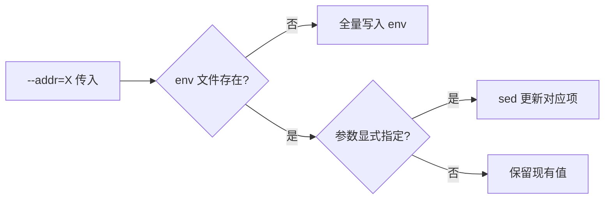
```mermaid
flowchart LR
    A["--addr=X 传入"] --> B{"env 文件存在?"}
    B -->|否| C["全量写入 env"]
    B -->|是| D{"参数显式指定?"}
    D -->|是| E["sed 更新对应项"]
    D -->|否| F["保留现有值"]
```

### BF-002: VM HTTP API `bind: cannot assign requested address`

**现象**：`HTTP API 启动失败: 无法监听 peerIP:2522: bind: cannot assign requested address`

**根因**：`extractPeerIP()` 计算 peer IP = local IP 最后字节 +1，然后尝试 bind 这个 peer IP。但 peer IP 是 TUN 隧道**对端**（Desktop）的地址，不是 VM 本机地址，无法绑定。

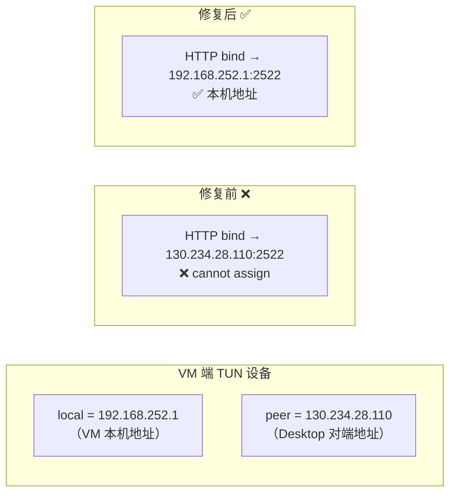
```mermaid
graph LR
    subgraph "VM 端 TUN 设备"
        LOCAL["local = 192.168.252.1<br/>（VM 本机地址）"]
        PEER_VM["peer = 130.234.28.110<br/>（Desktop 对端地址）"]
    end
    subgraph "修复前 ❌"
        BIND_OLD["HTTP bind → 130.234.28.110:2522<br/>❌ cannot assign"]
    end
    subgraph "修复后 ✅"
        BIND_NEW["HTTP bind → 192.168.252.1:2522<br/>✅ 本机地址"]
    end
```

**修复**：
- `extractPeerIP()` → `extractLocalIP()`，直接提取 addr 中的 IP（不再 +1）
- VM HTTP 服务绑定 local IP（VM 本机 TUN 地址），Desktop 反向代理连接此地址

### BF-003: 更新二进制时 `Text file busy` 错误

**现象**：重复部署时 `install.sh` 执行 `cp` 覆盖二进制文件失败：
```
cp: cannot create regular file '/usr/local/bin/docker-connector': Text file busy
```

**根因**：`install_binary()` 在 `install_service()` **之前**执行，而停止服务的逻辑在 `install_service()` 中。因此复制二进制文件时服务还在运行，Linux 不允许覆盖正在执行的文件。

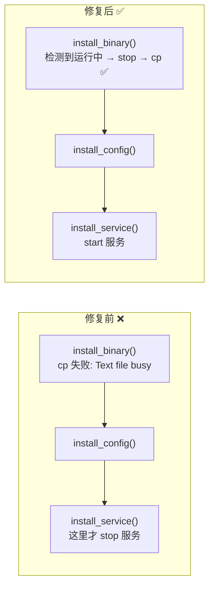
```mermaid
flowchart LR
    subgraph "修复前 ❌"
        A1["install_binary()<br/>cp 失败: Text file busy"] --> A2["install_config()"] --> A3["install_service()<br/>这里才 stop 服务"]
    end
    subgraph "修复后 ✅"
        B1["install_binary()<br/>检测到运行中 → stop → cp ✅"] --> B2["install_config()"] --> B3["install_service()<br/>start 服务"]
    end
```

**修复**：在 `install_binary()` 中，复制前检测服务是否运行，若在运行则先 `systemctl stop`。

### BF-004: Desktop 反向代理 path rewrite 错误导致 VM API 404

**现象**：Dashboard 页面报 `获取 VM 链路失败: HTTP 404`。`/api/vm/status`（本地处理）正常，但所有通过反向代理转发的 `/api/vm/*` 请求（如 `/api/vm/links`、`/api/vm/health`）都返回 404。

**根因**：`createVMReverseProxy()` 的 Director 使用 `strings.TrimPrefix` 去掉了 `/api/vm` 前缀，导致路径转换错误：

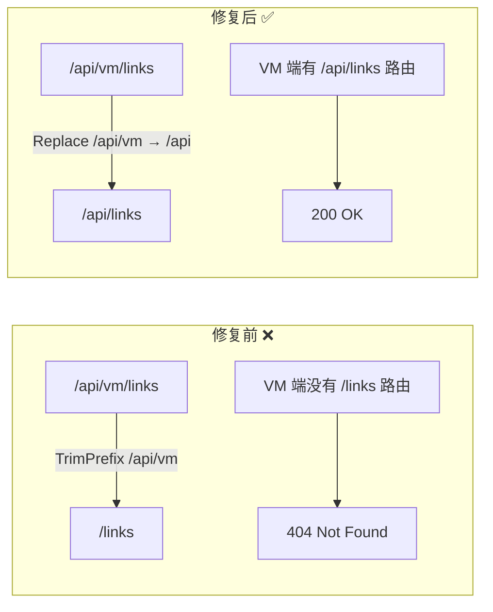
```mermaid
graph LR
    subgraph "修复前 ❌"
        A1["/api/vm/links"] -->|TrimPrefix /api/vm| A2["/links"]
        A3["VM 端没有 /links 路由"] --> A4["404 Not Found"]
    end
    subgraph "修复后 ✅"
        B1["/api/vm/links"] -->|Replace /api/vm → /api| B2["/api/links"]
        B3["VM 端有 /api/links 路由"] --> B4["200 OK"]
    end
```

| 请求路径 | 修复前转发到 VM | 修复后转发到 VM |
|----------|---------------|----------------|
| `/api/vm/links` | `/links` ❌ | `/api/links` ✅ |
| `/api/vm/apply` | `/apply` ❌ | `/api/apply` ✅ |
| `/api/vm/health` | `/health` ❌ | `/api/health` ✅ |
| `/api/vm/links/stream` | `/links/stream` ❌ | `/api/links/stream` ✅ |

**修复**：将 `strings.TrimPrefix(req.URL.Path, "/api/vm")` 改为 `strings.Replace(req.URL.Path, "/api/vm", "/api", 1)`。

**排查线索**：响应中出现双重 CORS header（Desktop 一层 + VM 一层），说明请求确实到达了 VM 端，但 VM 端路由匹配失败返回 404。

### BF-005: root 进程仍调用 sudo 导致 /api/links 超时 22 秒

**现象**：`GET /api/vm/links` 接口响应耗时约 22 秒，Desktop 反向代理 5 秒超时返回 502。

**根因**：systemd 服务默认以 root 运行，但代码中 `runCommandSudo()` 和 `RuleExists()` 仍然 fork `sudo` 进程执行命令。root 用户调用 sudo 虽然无需密码，但每次 sudo 都要经过 PAM session open/close 认证流程（~0.3-0.5s/次）。`/api/links` 接口需要逐条检查 40-60 条 iptables 规则，累计 PAM 开销约 12-30 秒。

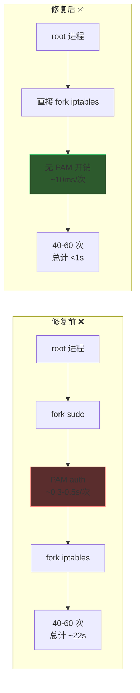
```mermaid
graph LR
    subgraph "修复前 ❌"
        A1["root 进程"] --> A2["fork sudo"]
        A2 --> A3["PAM auth<br/>~0.3-0.5s/次"]
        A3 --> A4["fork iptables"]
        A4 --> A5["40-60 次<br/>总计 ~22s"]
    end
    subgraph "修复后 ✅"
        B1["root 进程"] --> B2["直接 fork iptables"]
        B2 --> B3["无 PAM 开销<br/>~10ms/次"]
        B3 --> B4["40-60 次<br/>总计 <1s"]
    end
    style A3 fill:#5a2d2d,stroke:#f87171
    style B3 fill:#2d5a2d,stroke:#4ade80
```

**修复**：
- `infra_command.go`：新增 `isRoot()` 检测函数，`runCommandSudo()` 在 uid=0 时直接调用 `runCommand()` 跳过 sudo
- `infra_command.go`：新增 `runCommandSudoSilent()` 函数，提供与 `runCommandSilent` 对应的 sudo-aware 版本
- `infra_iptables.go`：`RuleExists()` 中直接拼接 `"sudo"` 改为调用 `runCommandSudoSilent()`

| 指标 | 修复前 | 修复后 | 提升 |
|------|--------|--------|------|
| `/api/links` 响应时间 | ~22s | <1s | **-95%** |
| per-iptables-check 耗时 | ~0.3-0.5s | ~10ms | **-97%** |
| 每次检查 fork 进程数 | 2 (sudo + iptables) | 1 (iptables) | **-50%** |

### BF-006: systemd 环境缺少 HOME 导致 kubectl 回退失败，/api/links 耗时 27 秒

**现象**：BF-005 修复后，`GET /api/vm/links` 接口响应仍然耗时约 27 秒。从 VM 内部直接调用也一样慢。

**根因**：systemd 服务环境中**没有 `HOME` 环境变量**。kubectl 依赖 `$HOME/.kube/config` 定位 kubeconfig 文件，缺少 HOME 时回退到 in-cluster config（尝试连接 Kubernetes service account），连接一个不存在的 API Server 地址，5 次重试后失败，每次调用耗时 ~2.7s。

`GetMinikubeInfo()` 内部的 `getServiceCIDR()` 和 `getPodCIDR()` 各尝试 3-4 个 kubectl 策略，全部失败，共计 8 次 kubectl 调用 × 2.7s ≈ 21.6s。加上 docker 命令和 iptables 检查，总计约 27 秒。

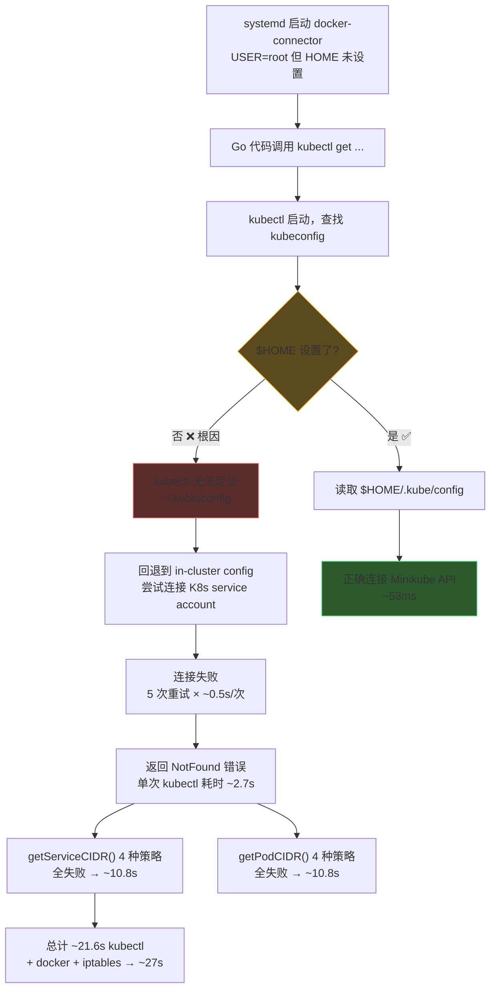
```mermaid
graph TD
    A["systemd 启动 docker-connector<br/>USER=root 但 HOME 未设置"]
    A --> B["Go 代码调用 kubectl get ..."]
    B --> C["kubectl 启动，查找 kubeconfig"]
    C --> D{"$HOME 设置了?"}
    D -->|"否 ❌ 根因"| E["kubectl 无法定位<br/>~/.kube/config"]
    E --> F["回退到 in-cluster config<br/>尝试连接 K8s service account"]
    F --> G["连接失败<br/>5 次重试 × ~0.5s/次"]
    G --> H["返回 NotFound 错误<br/>单次 kubectl 耗时 ~2.7s"]
    H --> I["getServiceCIDR() 4 种策略<br/>全失败 → ~10.8s"]
    H --> J["getPodCIDR() 4 种策略<br/>全失败 → ~10.8s"]
    I --> K["总计 ~21.6s kubectl<br/>+ docker + iptables → ~27s"]

    D -->|"是 ✅"| L["读取 $HOME/.kube/config"]
    L --> M["正确连接 Minikube API<br/>~53ms"]

    style E fill:#5a2d2d,stroke:#f87171
    style D fill:#5a4a1e,stroke:#fbbf24
    style M fill:#2d5a2d,stroke:#4ade80
```

**修复**（多层防御）：

1. **systemd 层**：`docker-connector.service` 添加 `Environment=HOME=/root`，确保 kubectl 能找到 kubeconfig
2. **kubectl 可用性检查**：新增 `kubectlAvailable()` 函数，启动时一次性检查 kubectl 是否存在 + kubeconfig 是否可达 + `cluster-info` 是否成功。失败则禁用所有 K8s 相关功能，避免后续无效调用
3. **kubectl 超时参数**：所有 kubectl 调用添加 `--request-timeout=3s`，即使环境异常也能快速失败
4. **缓存时间延长**：网络信息缓存从 5 秒延长到 60 秒（网桥/minikube 信息很少变化）

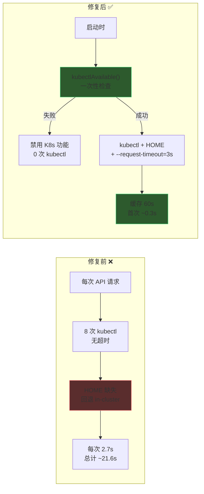
```mermaid
graph LR
    subgraph "修复前 ❌"
        A1["每次 API 请求"] --> A2["8 次 kubectl<br/>无超时"]
        A2 --> A3["HOME 缺失<br/>回退 in-cluster"]
        A3 --> A4["每次 2.7s<br/>总计 ~21.6s"]
    end
    subgraph "修复后 ✅"
        B1["启动时"] --> B2["kubectlAvailable()<br/>一次性检查"]
        B2 -->|"失败"| B3["禁用 K8s 功能<br/>0 次 kubectl"]
        B2 -->|"成功"| B4["kubectl + HOME<br/>+ --request-timeout=3s"]
        B4 --> B5["缓存 60s<br/>首次 ~0.3s"]
    end
    style A3 fill:#5a2d2d,stroke:#f87171
    style B2 fill:#2d5a2d,stroke:#4ade80
    style B5 fill:#2d5a2d,stroke:#4ade80
```

| 指标 | 修复前 | 修复后 | 提升 |
|------|--------|--------|------|
| `/api/links` 首次响应 | ~27s | <1s（kubectl 正常）/ ~0.1s（kubectl 不可用） | **-96%~99.6%** |
| `/api/links` 缓存命中 | ~27s（缓存 5s 后过期重来） | <50ms（缓存 60s） | **-99.8%** |
| kubectl 调用次数 | 每次 8 次，无论成功失败 | 启动检查 1 次，失败后 0 次 | **-100%** |

### BF-007: Dashboard VM Link 规则详情显示为空（字段名不匹配）

**现象**: 点击 VM Link 卡片的 "Details" 后，RULE 列全部显示为 `—`（破折号），无法看到具体规则。

**根因**: 前端 `renderVMLinkDetails` 函数中使用 `d.description || d.rule` 读取规则名，但后端 `RuleDetail` 结构体的 JSON 字段名是 `"label"`。字段名不匹配导致全部回退为默认值 `--`。

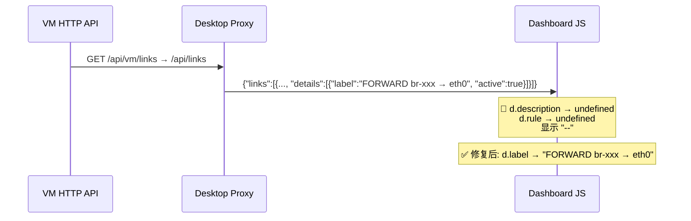
```mermaid
sequenceDiagram
    participant VM as VM HTTP API
    participant Desktop as Desktop Proxy
    participant UI as Dashboard JS

    VM->>Desktop: GET /api/vm/links → /api/links
    Desktop->>UI: {"links":[{..., "details":[{"label":"FORWARD br-xxx → eth0", "active":true}]}]}
    Note over UI: 🐛 d.description → undefined<br/>d.rule → undefined<br/>显示 "--"
    Note over UI: ✅ 修复后: d.label → "FORWARD br-xxx → eth0"
```

**修复方案**:
1. 前端 `renderVMLinkDetails`: `d.description || d.rule` → `d.label`
2. 后端 `RuleDetail` 增加 `Type` 字段（`"iptables"` / `"nat"` / `"route"` / `"dns"`），让规则详情能区分类型
3. `AppendCheckTyped()` 新方法，支持带类型参数的规则追加

### Feature: VM Link 网络拓扑可视化图

在 Dashboard VM Links 面板中新增 **Network Topology** SVG 拓扑图，直观展示 4 个域节点和 5 条链路关系：

```mermaid
graph LR
    Host["🖥 Host (macOS)<br/>via tun0 tunnel"] --- Docker["🐳 Docker<br/>bridge networks"]
    Host --- K8s["☸ Kubernetes<br/>minikube"]
    Docker --- K8s
    Docker --- Internet["🌐 Internet<br/>NAT masquerade"]
    Docker -.->|docker-docker| Docker
```

- 链路颜色随状态实时变化：🟢 Active / 🟡 Partial / ⚪ Inactive
- 点击链路线可查看该链路的规则详情
- 包含图例说明

### BF-008: docker-docker 链路 Apply 后入站规则显示 MISSING（缓存子串误匹配）

**现象**：docker-docker 链路 Apply 后，每个网桥的第 3 条规则（入站 `RELATED,ESTABLISHED`）始终显示 **MISSING**，前 2 条（自身转发 + 出站）正常显示 ACTIVE。

**根因**：`infra_iptables.go` 中 `ruleExistsInCache()` 使用 `strings.Contains()` 进行子串匹配，导致入站规则被误判为"已存在"而跳过添加。

具体来说：
- 入站规则：`-o br-xxx -m conntrack --ctstate RELATED,ESTABLISHED -j ACCEPT`（**不带** `-i`）
- 其他链路已创建的规则：`-i br-yyy -o br-xxx -m conntrack --ctstate RELATED,ESTABLISHED -j ACCEPT`（**带** `-i br-yyy`）

后者**包含**前者作为子串，`strings.Contains()` 匹配成功 → 误判为已存在 → 跳过 `iptables -A` → Apply 完成后实际未添加规则 → Status 用 `iptables -C` 精确检查 → MISSING。

**冲突流程**：

```mermaid
sequenceDiagram
    participant Cache as iptables -S 缓存
    participant Commit as Commit() 批量添加
    participant IPT as iptables (FORWARD 链)

    Note over Cache,IPT: 缓存中已有其他链路的规则
    Cache->>Cache: 加载缓存：iptables -S FORWARD<br/>包含 "-A FORWARD -i br-yyy -o br-xxx<br/>-m conntrack --ctstate RELATED,ESTABLISHED -j ACCEPT"

    Note over Commit,IPT: docker-docker Apply 入站规则
    Commit->>Cache: ruleExistsInCache?<br/>查找 "-o br-xxx -m conntrack --ctstate RELATED,ESTABLISHED -j ACCEPT"
    Cache->>Commit: strings.Contains() = true ❌<br/>(子串匹配到了带 -i 前缀的其他规则)
    Note over Commit: 误判为"已存在"→ 跳过添加

    Note over Commit,IPT: Status 检查
    Commit->>IPT: iptables -C FORWARD<br/>-o br-xxx -m conntrack --ctstate ... -j ACCEPT
    IPT->>Commit: Bad rule ❌<br/>(精确匹配：规则不存在)
    Note over Commit: 显示 MISSING
```

**为什么只有入站规则受影响？**

| 规则 | 格式 | 是否为其他规则的子串？ |
|------|------|----------------------|
| `-i br -o br` (自身转发) | 含 `-i` 和 `-o` | ❌ 独特组合，不会误匹配 |
| `-i br ... ESTABLISHED` (出站) | 含 `-i` | ❌ 不是子串 |
| **`-o br ... ESTABLISHED` (入站)** | **不含 `-i`** | **⚠️ 是其他带 `-i` 规则的子串！** |

**修复**：

1. **主修复**（`infra_iptables.go`）：将 `ruleExistsInCache()` 从 `strings.Contains()` 子串匹配改为**逐行精确匹配**。构造完整行格式 `-A CHAIN rule...` 再与缓存逐行对比，确保不会误匹配到包含更多参数的其他规则。

2. **附带修复**（5 个链路文件）：将 `-m state --state` 统一替换为 `-m conntrack --ctstate`，与 Docker daemon 规则格式保持一致（`-m state` 在 Linux 内核中已被标记为 deprecated）。

| 文件 | 修改内容 |
|------|---------|
| `infra_iptables.go` | `ruleExistsInCache()` 从 `strings.Contains` → 逐行精确匹配 |
| `link_docker_docker.go` | 2 处 `-m state --state` → `-m conntrack --ctstate` |
| `link_host_docker.go` | 1 处 |
| `link_docker_k8s.go` | 1 处 |
| `link_internet.go` | 1 处 |
| `link_host_k8s.go` | 1 处 |

**验证结果**：Revert → Apply 后 docker-docker 链路 **12/12 rules active** ✅，5 秒后仍稳定。

## 十三、遗留问题

- [ ] Phase 3: 自动修复 + 定时校验告警
- [x] Lima VM 一键部署脚本 (`deploy-to-lima.sh`，macOS 端编译+传输+安装全自动)
- [x] macOS Desktop 端一键编译更新脚本 (`deploy-desktop.sh`，编译+替换+重启全自动)
- [ ] Lima VM 名称配置（用于 Desktop 自动探测）
- [ ] `--no-dashboard` flag（可选关闭 Dashboard）
- [ ] 容器模式 Dockerfile 更新（可选集成 docker-cli）
- [ ] UDP 优化 P4/P5（控制包 ACK/重传、并发 Pipeline）— 按需实施
- [ ] 生产环境安全加固（TLS、鉴权 Token）— 当前内网可信环境暂不需要
