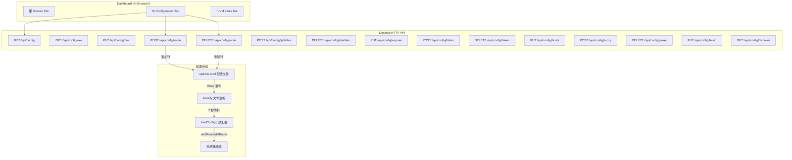
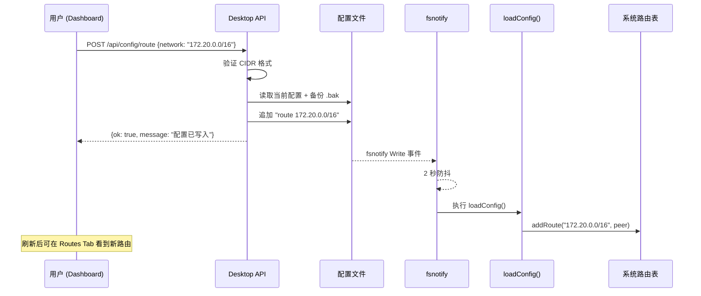

# Phase 3: Dashboard 配置管理功能

## 一、需求概述

在 Dashboard Web UI 中新增 Configuration Tab，提供可视化的配置管理能力，替代手动编辑 `options.conf` 配置文件。

### 核心目标
1. **可视化配置管理** — 在 Dashboard 中以友好的 UI 查看和编辑所有配置
2. **分类清晰** — 基础配置、路由管理、子网互通、导出控制、DNS/代理 分区呈现
3. **安全操作** — 基础配置（需重启的）只读展示 + 警告提示；动态配置支持增删改
4. **智能路由** — 从 Docker 自动发现 bridge 子网，一键添加
5. **实时反馈** — 修改后配置文件热加载自动生效（fsnotify 2 秒防抖）
6. **防误操作** — 删除/修改前二次确认 + 配置文件备份

## 二、架构设计

### 2.1 系统架构

### 2.2 热加载流程

## 三、配置项分类

| 类型 | 配置项 | 热加载 | Dashboard 操作 |
|------|--------|--------|---------------|
| **基础配置** | `addr`, `port`, `mtu`, `host` | ❌ 需重启 | 可编辑 + 重启警告 |
| **动态路由** | `route` | ✅ | 增/删 + 自动发现 |
| **子网互通** | `iptables` | ✅ | 增/删 |
| **导出控制** | `expose` | ✅ | 编辑 |
| **令牌** | `token` | ✅ | 增/删 |
| **DNS** | `hosts` | ✅ | 编辑 |
| **代理** | `proxy` | ✅ | 增/删 |
| **日志级别** | `loglevel` | ✅ | 编辑 |
| **心跳回应** | `pong` | ✅ | 开关 |

## 四、API 设计

| Method | Path | 说明 | Request Body | Response |
|--------|------|------|-------------|----------|
| `GET` | `/api/config` | 获取结构化配置 | — | `ConfigResponse` |
| `GET` | `/api/config/raw` | 获取原始配置文件 | — | `{content}` |
| `PUT` | `/api/config/raw` | 覆盖整个配置文件 | `{content}` | `{ok, message}` |
| `POST` | `/api/config/route` | 添加路由 | `{network, expose}` | `{ok, message}` |
| `DELETE` | `/api/config/route` | 删除路由 | `{network}` | `{ok, message}` |
| `POST` | `/api/config/iptables` | 添加互通规则 | `{subnet_a, subnet_b}` | `{ok, message}` |
| `DELETE` | `/api/config/iptables` | 删除互通规则 | `{subnet_a, subnet_b}` | `{ok, message}` |
| `PUT` | `/api/config/expose` | 更新 expose | `{address}` | `{ok, message}` |
| `POST` | `/api/config/token` | 添加 token | `{name, ip}` | `{ok, message}` |
| `DELETE` | `/api/config/token` | 删除 token | `{name}` | `{ok, message}` |
| `PUT` | `/api/config/hosts` | 更新 hosts | `{value}` | `{ok, message}` |
| `POST` | `/api/config/proxy` | 添加 proxy | `{rule}` | `{ok, message}` |
| `DELETE` | `/api/config/proxy` | 删除 proxy | `{rule}` | `{ok, message}` |
| `PUT` | `/api/config/basic` | 更新基础配置 | `{loglevel, pong}` | `{ok, message}` |
| `GET` | `/api/config/discover` | 自动发现 Docker 子网 | — | `{networks}` |

## 五、文件修改范围

| 文件 | 修改内容 | 实际代码量 |
|------|---------|-----------|
| `desktop/config.go` | 新增 `parseConfigToJSON()`、`removeConfigLine()`、`readConfigRaw()`、`writeConfigRaw()`、`addConfigLine()`、`backupConfigFile()`、`discoverDockerSubnets()` + 数据模型 | ~300 行 |
| `desktop/dashboard.go` | 新增 11 个 API handler（config/route/iptables/expose/token/hosts/proxy/basic/discover/raw）+ 路由注册 + logging import | ~350 行 |
| `desktop/dashboard_html.go` | 新增 Configuration Tab (CSS ~120行 + HTML ~130行 + JS ~400行) + 确认对话框 | ~650 行 |

## 六、实施进展

| 步骤 | 说明 | 状态 |
|------|------|------|
| 1. 创建需求文档 | 本文档 | ✅ 完成 |
| 2. 后端工具函数 | config.go 新增 7 个配置读写函数 + 6 个数据模型 | ✅ 完成 |
| 3. 后端 API handler | dashboard.go 新增 11 个 config API handler | ✅ 完成 |
| 4. 前端 UI | dashboard_html.go 新增 Configuration Tab（6 个配置区域 + 确认对话框 + 原始编辑器） | ✅ 完成 |
| 5. 编译验证 | Desktop (darwin/arm64) ✅ + Docker/VM (linux/arm64) ✅ | ✅ 完成 |

### 实施的功能清单

| 功能 | 描述 | 状态 |
|------|------|------|
| 基础配置展示 | addr/port/mtu/host 只读展示 + 重启警告 | ✅ |
| 日志级别切换 | loglevel 下拉选择，热加载生效 | ✅ |
| Pong 开关 | pong on/off 切换 | ✅ |
| 路由管理 | 添加/删除路由，CIDR 格式验证 | ✅ |
| Docker 子网自动发现 | 调用 docker CLI 发现 bridge 子网，一键添加 | ✅ |
| iptables 互通规则 | 添加/删除子网互通规则 | ✅ |
| expose 配置 | 编辑导出地址 | ✅ |
| token 管理 | 添加/删除访问令牌 | ✅ |
| hosts 配置 | 编辑 DNS hosts 配置 | ✅ |
| proxy 管理 | 添加/删除代理规则 | ✅ |
| 原始配置编辑器 | 折叠式 textarea，可直接编辑配置文件 | ✅ |
| 删除确认对话框 | 所有删除操作二次确认 | ✅ |
| 配置文件备份 | 每次写入前自动备份 .bak | ✅ |
| 并发安全 | configMu 互斥锁保护配置文件读写 | ✅ |

## 七、遗留问题

- Go 1.13 限制：使用 `ioutil.ReadFile/WriteFile` 替代 `os.ReadFile/WriteFile`（Go 1.16+），未来可考虑升级 Go 版本
- 基础配置（addr/port/mtu/host）的修改需要在原始编辑器中手动编辑并重启服务
- Docker 子网自动发现依赖本地安装的 `docker` CLI
