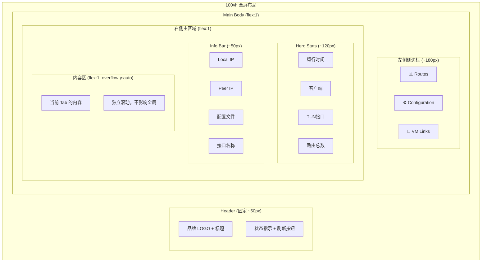
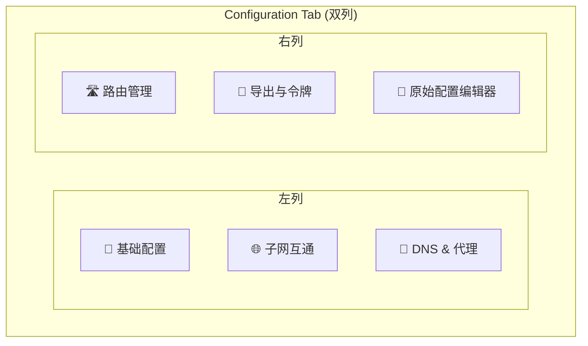

# Phase 4: Dashboard 侧边栏布局改造

## 一、需求概述

将 Dashboard 的 Tab 导航从顶部水平布局改为左侧垂直侧边栏布局，同时优化整体页面布局消除长垂直滚动条。

### 核心目标
1. **左侧侧边栏导航** — Tab 从顶部移到左侧，释放纵向空间
2. **100vh 全屏布局** — 消除全局滚动条，内容区域独立滚动
3. **Configuration 双列布局** — 将 6 个配置区域分为左右两列
4. **响应式适配** — 小屏幕侧边栏折叠为顶部栏
5. **自定义滚动条** — 暗色主题统一风格

## 二、布局设计

### 2.1 新布局结构

### 2.2 Configuration Tab 双列布局

## 三、实施进展

| 步骤 | 说明 | 状态 |
|------|------|------|
| 1. 创建需求文档 | 本文档 | ✅ 完成 |
| 2. CSS 改造 | body 100vh + .app flex-column + 侧边栏样式 + 独立滚动区 + 自定义滚动条 | ✅ 完成 |
| 3. HTML 改造 | 顶部 tab-bar → 左侧 sidebar-nav + hero/info 移到 main-header + tab panels 包裹在 main-scroll | ✅ 完成 |
| 4. 响应式 CSS | 1024px 侧边栏折叠为图标栏 + 640px 侧边栏变水平顶部栏 + config 单列 | ✅ 完成 |
| 5. Config 双列布局 | 6 个 config-section 分为左右两列（3+3），config-columns grid | ✅ 完成 |
| 6. 编译验证 | Desktop (darwin/arm64) ✅ + Docker (linux/arm64) ✅ | ✅ 完成 |

### 改造详情

| 改造项 | Before | After |
|--------|--------|-------|
| 页面高度 | 自然流，无限延伸 | `height:100vh` 固定，无全局滚动条 |
| 导航方式 | 顶部水平 tab-bar | 左侧 180px 垂直侧边栏 |
| 内容滚动 | 整页滚动 | `main-scroll` 独立滚动区，暗色自定义滚动条 |
| Config 布局 | 6 个区域纵向堆叠（~3000px） | 双列 grid（~1200px） |
| Header 高度 | ~80px（padding 较大） | ~50px（精简 padding） |
| Hero/Info | 参与全局滚动 | 固定在 main-header（不滚动） |
| 响应式 | 仅有基础适配 | 1024px 图标侧边栏 + 640px 水平导航 |

## 四、文件修改范围

| 文件 | 修改内容 |
|------|---------|
| `desktop/dashboard_html.go` | CSS: 新增侧边栏/布局/滚动条样式 (~60行), 修改 body/app/tab-bar/config 样式, 新增响应式断点; HTML: 整体结构重组（sidebar + main-area + main-scroll）; JS: switchTab 适配 sidebar-btn |

## 五、遗留问题

- 侧边栏底部 VM 状态指示器在折叠模式下隐藏（1024px 以下仅显示图标）
- 大屏幕（>1400px）侧边栏宽度可以考虑进一步优化
