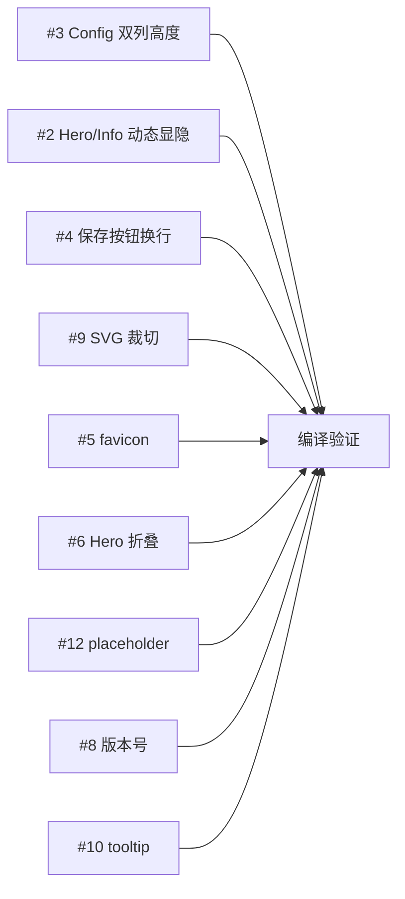

# Phase 5: Dashboard UI 优化与打磨

## 一、需求概述

基于浏览器实际访问审查，修复 Dashboard 页面的布局、交互、美观和体验问题。

## 二、问题清单

### 🔴 P0 — 必须修复

| # | 问题 | 描述 | 解决方案 |
|---|------|------|---------|
| 3 | Config Tab 左右列高度不均衡 | 左列内容少底部空白大，右列(路由12条+导出+编辑器)很长 | 改用 `align-items:stretch` 或让短列有 min-height 自适应 |
| 2 | Hero/Info 在所有 Tab 都显示占空间 | Config/VM Links Tab 不需要运行时间/客户端等信息 | Tab 切换时动态显示/隐藏 Hero+Info 区域 |

### 🟡 P1 — 应该修复

| # | 问题 | 描述 | 解决方案 |
|---|------|------|---------|
| 4 | 保存按钮文字被挤压换行 | expose 输入框旁"保存"按钮在窄列变两行 | 固定按钮 `white-space:nowrap` + 调整 input 宽度 |
| 9 | Network Topology SVG 被裁切 | 拓扑图上半部分被 Hero 区域遮挡 | 确保 topo-card 有足够高度 + viewBox 调整 |
| 5 | Console 404 错误 (favicon) | 缺少 favicon.ico | 添加 inline SVG favicon |

### 🟢 P2 — 体验优化

| # | 问题 | 描述 | 解决方案 |
|---|------|------|---------|
| 6 | Hero Stats 可折叠 | 确认状态正常后可折叠释放空间 | 添加折叠按钮，记住折叠状态 |
| 12 | placeholder 颜色区分度 | 输入框 placeholder 与实际值颜色差异不够 | 降低 placeholder 颜色亮度 |

### 🔵 P3 — 美化细节

| # | 问题 | 描述 | 解决方案 |
|---|------|------|---------|
| 8 | 侧边栏底部品牌文字 | "Docker Connector" 太低调 | 增加版本号信息 |
| 10 | 响应式图标 tooltip | 折叠模式图标没有提示 | 添加 title 属性 |

## 三、实施进展

| 步骤 | 说明 | 状态 |
|------|------|------|
| 0. 创建需求文档 | 本文档 | ✅ 完成 |
| 1. P0: Config 双列高度 | CSS align-items:stretch 让两列等高 | ✅ 完成 |
| 2. P0: Hero/Info 动态显隐 | Tab 切换时 Routes Tab 显示、其他 Tab 隐藏 Hero+Info 区域 | ✅ 完成 |
| 3. P1: 保存按钮换行 | btn-sm 添加 white-space:nowrap + expose input flex 布局 | ✅ 完成 |
| 4. P1: SVG 裁切 | VM Links Tab 不再显示 Hero 区域，SVG 完整可见 | ✅ 完成 |
| 5. P1: favicon | 添加 inline SVG favicon (🐳 emoji) | ✅ 完成 |
| 6. P2: Hero 折叠 | 添加折叠/展开按钮 + JS 状态管理 | ✅ 完成 |
| 7. P2: placeholder | placeholder opacity:0.5 增强区分度 | ✅ 完成 |
| 8. P3: 版本号 | sidebar-footer 添加 v2.1 版本号 | ✅ 完成 |
| 9. P3: tooltip | sidebar 按钮添加 title 属性 | ✅ 完成 |
| 10. 编译验证 + 文档更新 | 双端编译通过 (darwin/arm64 + linux/arm64) | ✅ 完成 |

## 四、文件修改范围

| 文件 | 修改内容 |
|------|---------|
| `desktop/dashboard_html.go` | CSS: config-columns align-items:stretch, btn-sm nowrap, placeholder opacity, hero-toggle 样式, main-header collapsed 动画; HTML: favicon, sidebar title/版本号, hero 折叠按钮, expose 布局; JS: switchTab Hero 显隐, toggleHero 折叠函数 |

## 五、实施细节

### CSS 修改 (~20行)
- `.config-columns`: `align-items:start` → `align-items:stretch`（双列等高）
- `.btn-sm`: 添加 `white-space:nowrap;flex-shrink:0`
- `.config-add-row input::placeholder`: 添加 `opacity:0.5` + `.config-field input::placeholder` 同步
- `.main-header`: 添加 `transition` 动画属性
- `.main-header.collapsed`: 新增折叠状态样式
- `.hero-toggle-bar` + `.hero-toggle-btn`: 新增折叠控制栏样式

### HTML 修改 (~10行)
- `<head>`: 添加 inline SVG favicon
- `.sidebar-btn`: 添加 `title` 属性（Routes/Configuration/VM Links）
- `.sidebar-footer`: 添加版本号 `v2.1`
- `.main-header`: 添加 `id="mainHeader"`
- 新增 `.hero-toggle-bar` 折叠控制栏
- `.cfgExposeInput`: `width:180px` → `flex:1;min-width:120px`

### JS 修改 (~25行)
- `switchTab()`: 根据 tab 类型控制 Hero/Info 区域 + 折叠按钮显隐
- `toggleHero()`: 新增折叠/展开切换函数
- `heroCollapsed`: 新增状态变量

## 六、遗留问题

| # | 问题 | 说明 |
|---|------|------|
| 1 | SSE 重连错误 | Tab 切换时 `api/vm/links/stream` ERR_INCOMPLETE_CHUNKED_ENCODING，这是 SSE 断开重连的正常行为，非致命错误 |
| 2 | 路由表信息冗余(#7) | Routes 表格 Gateway/Interface 列值大量相同，可后续考虑折叠相同值。优先级低，暂不处理 |
| 3 | 自动发现按钮位置(#11) | Docker 子网自动发现按钮位置偏上，操作流不够连贯。优先级低，暂不处理 |
