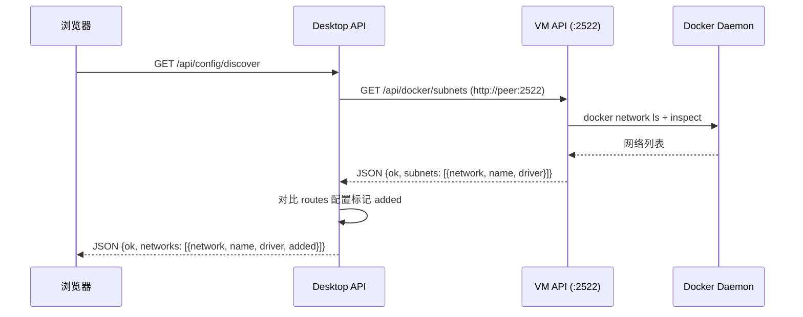
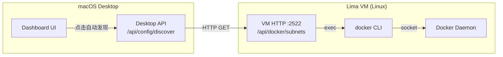

# Phase 6: Docker 子网自动发现 — 通过 VM API 实现

## 一、需求概述

Dashboard 的"自动发现 Docker 子网"功能此前直接在 macOS 上执行 `docker network ls` 命令，但 Docker 实际运行在 Lima VM 中，macOS 上没有 docker CLI，导致报错：

> `docker network ls 失败: exec: "docker": executable file not found in $PATH`

**解决方案**：在 VM 端新增 `/api/docker/subnets` API，Desktop 端通过 HTTP 请求 VM 端获取子网信息，完全不依赖本地 docker CLI。

## 二、架构设计





## 三、实施进展

| 步骤 | 说明 | 状态 |
|------|------|------|
| 1. VM 端新增 API | `/api/docker/subnets` handler + 路由注册 | ✅ 完成 |
| 2. Desktop 端改造 | `discoverDockerSubnets()` 改为 HTTP 调用 VM API | ✅ 完成 |
| 3. 编译验证 | 双端编译通过 (darwin/arm64 + linux/arm64) | ✅ 完成 |
| 4. 文档记录 | 本文档 | ✅ 完成 |

## 四、文件修改范围

| 文件 | 修改内容 |
|------|----------|
| `docker/vm_http_server.go` | 新增 `handleDockerSubnets()` 方法 + 注册 `/api/docker/subnets` 路由 |
| `desktop/config.go` | 重写 `discoverDockerSubnets()`：移除本地 docker CLI 调用，改为 HTTP 请求 VM 端 API |

## 五、实施细节

### VM 端: `docker/vm_http_server.go`

**路由注册** (1 行)：
```go
mux.HandleFunc("/api/docker/subnets", s.handleDockerSubnets)
```

**新增 handler** (~30 行)：
- `handleDockerSubnets()` — 复用 `s.linkMgr.Bridges()` 获取所有 Docker bridge 网桥信息
- 将 `BridgeInfo` 转换为与 Desktop `DockerSubnet` 兼容的 JSON 格式
- 返回 `{ok: true, subnets: [{network, name, driver}]}`

### Desktop 端: `desktop/config.go`

**import 变更**：新增 `"net/http"` 和 `"time"`

**重写 `discoverDockerSubnets()`** (~45 行)：
1. 检查 `peer` 是否已初始化（VM 是否已连接）
2. 构造 VM API URL: `http://{peer}:{vmHTTPPort}/api/docker/subnets`
3. HTTP GET 请求（5 秒超时）
4. 解析 JSON 响应
5. 对比本地 `routes` 配置标记 `added` 字段

### API 响应格式

**VM 端 `/api/docker/subnets` 响应**：
```json
{
  "ok": true,
  "subnets": [
    {"network": "172.17.0.0/16", "name": "docker0", "driver": "bridge"},
    {"network": "172.18.0.0/16", "name": "br-abc123", "driver": "bridge"}
  ]
}
```

**Desktop 端 `/api/config/discover` 响应**（不变）：
```json
{
  "ok": true,
  "networks": [
    {"network": "172.17.0.0/16", "name": "docker0", "driver": "bridge", "added": true},
    {"network": "172.18.0.0/16", "name": "br-abc123", "driver": "bridge", "added": false}
  ]
}
```

## 六、遗留问题

| # | 问题 | 说明 |
|---|------|------|
| 无 | — | — |
