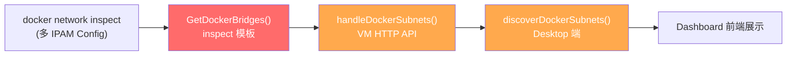
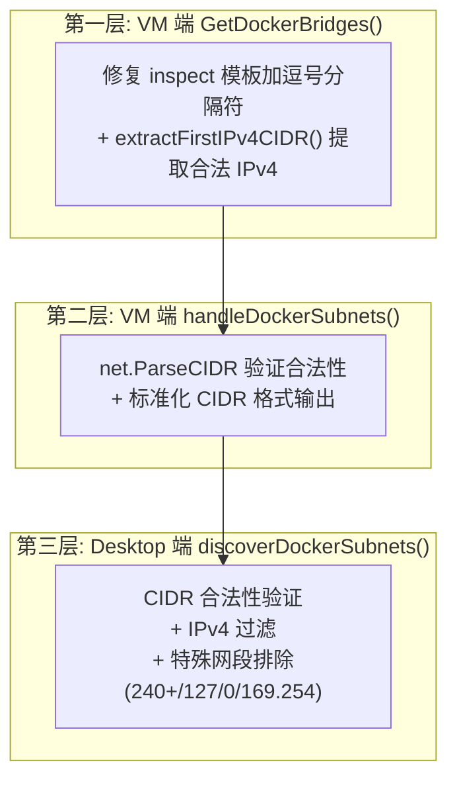

# Phase 6: Docker 子网自动发现 CIDR 过滤

## 一、需求概述

修复 Docker 子网自动发现功能中，Minikube 等特殊 Docker 网络（IPv4+IPv6 双栈）导致的 CIDR 拼接异常问题，并在多层增加防御性过滤。

## 二、问题分析

### 根本原因

`GetDockerBridges()` 中的 Docker inspect 模板：

```
{{range .IPAM.Config}}{{.Subnet}}{{end}}
```

当一个 Docker 网络有**多个 IPAM Config**（如 Minikube 的 IPv4 + IPv6 双栈）时，`range` 会把所有子网**不带分隔符**地拼接在一起：

| 场景 | IPAM Config | 模板输出 |
|------|-------------|---------|
| 单 IPv4 | `["172.17.0.0/16"]` | `172.17.0.0/16` ✅ |
| 双栈 | `["192.168.49.0/24", "fc00:f853:ccd:e793::/64"]` | `192.168.49.0/24fc00:f853:ccd:e793::/64` ❌ |

拼接后的字符串不是合法 CIDR，导致前端展示异常地址（如 `192.168.49.2`）。

### 数据流路径



## 三、解决方案

### 三层防御架构



## 四、实施进展

| 步骤 | 说明 | 状态 |
|------|------|------|
| 0. 创建需求文档 | 本文档 | ✅ 完成 |
| 1. VM 端 inspect 模板修复 | 加逗号分隔符 + `extractFirstIPv4CIDR()` 辅助函数 | ✅ 完成 |
| 2. VM 端 API 过滤 | `handleDockerSubnets()` 添加 `net.ParseCIDR` 验证 | ✅ 完成 |
| 3. Desktop 端过滤 | `discoverDockerSubnets()` 添加 CIDR 验证 + 特殊网段过滤 | ✅ 完成 |
| 4. 编译验证 | 双端编译通过 (darwin/arm64 + linux/arm64) | ✅ 完成 |

## 五、文件修改范围

| 文件 | 修改内容 |
|------|---------| 
| `docker/infra_network.go` | 1. import 添加 `net` 包<br/>2. `GetDockerBridges()`: inspect 模板加逗号分隔，subnet 改用 `extractFirstIPv4CIDR()` 提取<br/>3. `GetMinikubeInfo()`: 同步修复 inspect 模板<br/>4. 新增 `extractFirstIPv4CIDR()` 辅助函数 |
| `docker/vm_http_server.go` | `handleDockerSubnets()`: 添加 `net.ParseCIDR` 验证 + `ipNet.String()` 标准化输出 |
| `desktop/config.go` | `discoverDockerSubnets()`: 添加 CIDR 合法性验证 + IPv4 过滤 + 特殊网段排除 |

## 六、实施细节

### `extractFirstIPv4CIDR()` 辅助函数

从可能包含多个 CIDR（逗号分隔）的字符串中提取第一个合法的 IPv4 CIDR：

1. 优先按逗号分隔，逐个用 `net.ParseCIDR` 验证，取第一个 IPv4
2. 兜底：如果没有逗号（旧格式拼接），用正则 `\d{1,3}\.\d{1,3}\.\d{1,3}\.\d{1,3}/\d{1,2}` 提取

### Desktop 端过滤规则

| 过滤条件 | 说明 |
|----------|------|
| `net.ParseCIDR` 失败 | 非法 CIDR 格式 |
| `ip.To4() == nil` | 非 IPv4 地址（IPv6） |
| 第一个字节 ≥ 240 | 保留地址段（240.0.0.0/4 含 255.x.x.x） |
| 第一个字节 = 127 | 回环地址 |
| 第一个字节 = 0 | 特殊地址 |
| 169.254.x.x | 链路本地地址 |

## 七、遗留问题

无。
