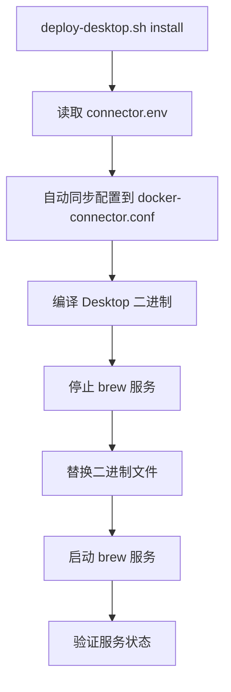

# connector.env 配置同步到 Desktop 端

## 需求背景

当前 VM 端使用 `deploy/connector.env` 作为配置源，而 Desktop 端使用 `docker-connector.conf` 配置文件。两端的核心网络参数（addr、port、vm-http-port）需要保持一致，但目前需要手动维护，容易出错。

## 目标

以 `deploy/connector.env` 作为统一配置源，每次执行 `deploy-desktop.sh` 安装时，**默认自动**从 `connector.env` 同步配置到 Desktop 端的 `docker-connector.conf`。

## 配置同步规则

| connector.env 变量 | docker-connector.conf 配置项 | 说明 |
|---|---|---|
| `CONNECTOR_PORT=2521` | `port 2521` | Desktop UDP 监听端口 |
| `CONNECTOR_ADDR=192.168.252.1/24` | `addr 192.168.252.1/24` | 虚拟网络地址 |
| `CONNECTOR_HTTP_PORT=2522` | `vm-http-port 2522` | VM 端 HTTP API 端口 |
| `CONNECTOR_HOST` | ❌ 不同步 | VM 端专用配置 |

## 安全考虑

- 只更新 `addr`、`port`、`vm-http-port` 三项核心网络参数
- 保留用户自定义的 `route`、`expose`、`token`、`iptables`、`hosts`、`proxy` 等配置
- 不做自动备份

## 流程图

## 实施步骤

### 1. 修改 `desktop/config.go` — 支持解析 `vm-http-port` 配置项

- [x] `BasicConfig` 结构体新增 `VmHTTPPort int` 字段
- [x] `loadConfig()` 的 switch 中新增 `vm-http-port` case，解析后赋值给全局 `vmHTTPPort`
- [x] `parseConfigToJSON()` 初始化时读取 `vmHTTPPort`，解析配置文件时同步支持

**状态**: ✅ 已完成

### 2. 修改 `deploy/deploy-desktop.sh` — 新增 `do_sync_config()` 函数

- [x] 新增 `do_sync_config()` 函数，从 `connector.env` 读取 `CONNECTOR_PORT`、`CONNECTOR_ADDR`、`CONNECTOR_HTTP_PORT`
- [x] 用 `sed -i ''` 原地更新 `docker-connector.conf` 中对应的 `port`、`addr`、`vm-http-port` 行
- [x] 如果 conf 文件不存在，则从 env 生成初始配置
- [x] 如果 conf 中缺少某配置项，则追加到文件末尾
- [x] 在 deploy 主流程 Step 0（编译前）默认执行配置同步

**状态**: ✅ 已完成

### 3. 编译验证

- [x] `go build` 编译通过，无错误

**状态**: ✅ 已完成

## 修改文件清单

| 文件 | 修改内容 |
|---|---|
| `desktop/config.go` | `BasicConfig` 新增 `VmHTTPPort` 字段；`loadConfig()` 和 `parseConfigToJSON()` 新增 `vm-http-port` 解析 |
| `deploy/deploy-desktop.sh` | 新增 `do_sync_config()` 函数；deploy 流程 Step 0 默认调用配置同步 |

## 遗留问题

- 暂无
