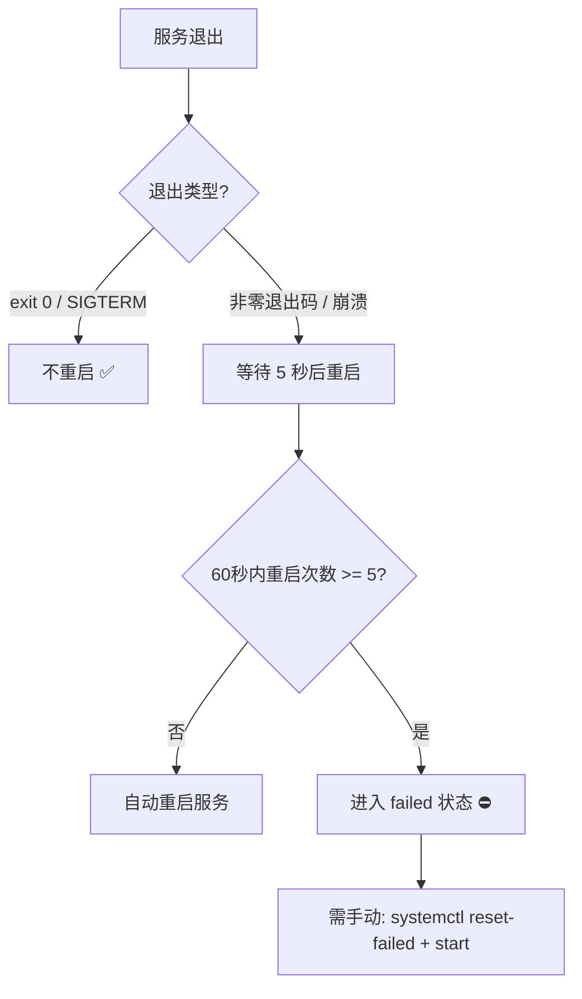

# Systemd 服务重启策略优化

## 需求背景

在 Lima VM 中部署 `docker-connector` 服务时，原先使用 `Restart=always` 策略，存在以下问题：

- 当通过 `systemctl stop` 正常停止服务时，服务会被自动重新拉起
- 收到 `SIGTERM` 信号后优雅关闭，也会被重新启动
- 在某些场景下可能导致服务重启过快

## 方案选择

| 方案 | 策略 | 优点 | 缺点 |
|------|------|------|------|
| A（原方案） | `Restart=always` | 任何情况都自动恢复 | stop 后也会重启 |
| **B（采纳）** | **`Restart=on-failure`** | **正常退出不重启，异常崩溃自动恢复** | **exit 0 退出不恢复** |
| C | `on-failure` + 增大间隔 | 更保守 | 恢复速度慢 |

## 实施方案

### 修改文件

- `deploy/docker-connector.service`

### 修改内容

将 `Restart=always` 改为 `Restart=on-failure`，其余重启参数保持不变。

### 最终配置

```ini
# 重启策略（on-failure: 仅在异常退出时重启，正常 stop/SIGTERM 不重启）
Restart=on-failure
RestartSec=5
StartLimitInterval=60
StartLimitBurst=5
```

## 行为说明



## 实施进展

- [x] 修改 `docker-connector.service` 中 `Restart=always` → `Restart=on-failure`
- [x] 更新注释说明
- [x] 创建需求文档

## 遗留问题

- 无
