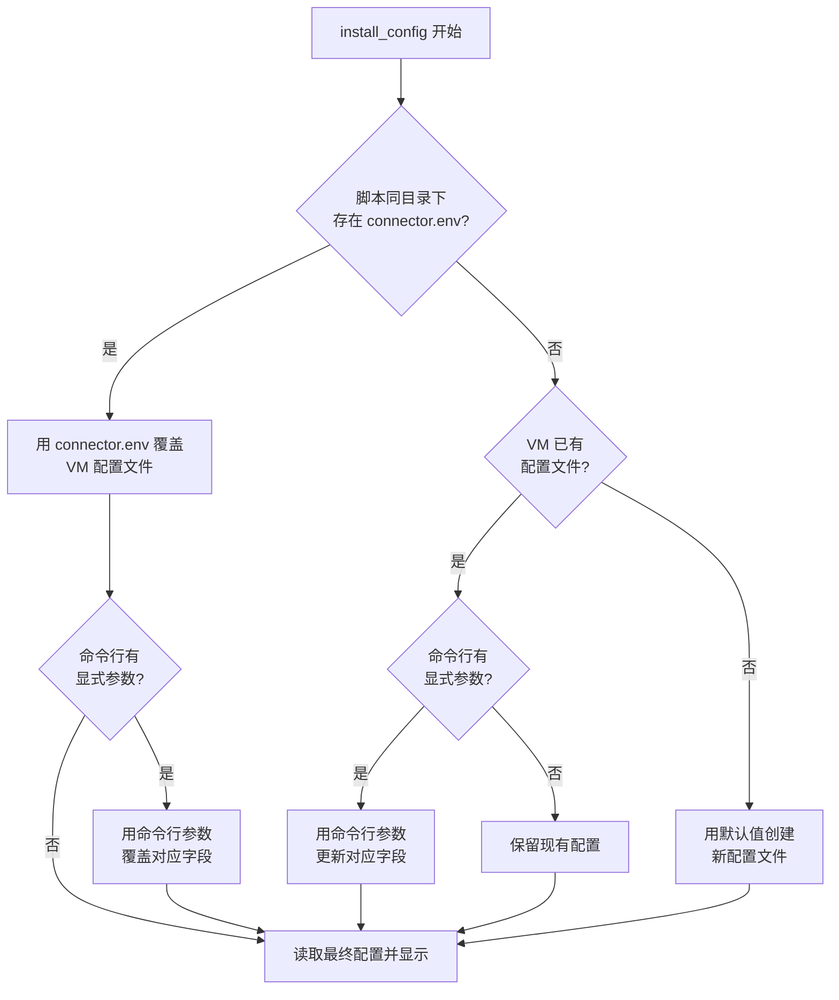
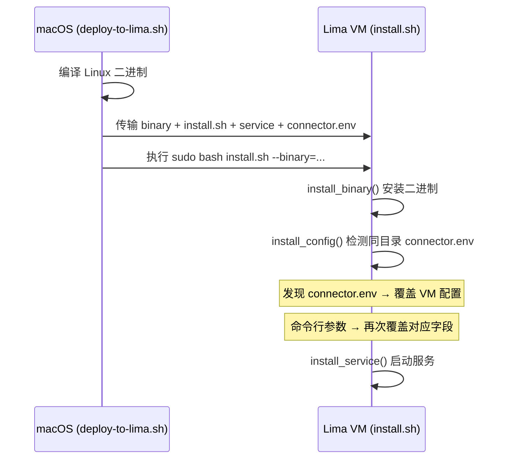

# Lima VM 配置更新优化

## 需求背景

当 Lima VM 中已存在 `/etc/docker-connector/connector.env` 配置文件时，执行 `deploy-to-lima.sh` 部署不会以本地 `deploy/connector.env` 为主更新 VM 中的配置。用户在 macOS 端修改了 `connector.env` 后重新部署，VM 中的配置不会同步更新。

## 问题分析

原有 `install.sh` 的 `install_config()` 逻辑：
- 如果 VM 已有配置文件 → 仅更新命令行 `--addr=` 等显式指定的参数，其余保留旧值
- 如果 VM 无配置文件 → 用默认值创建

`deploy-to-lima.sh` 虽然将 `connector.env` 传输到了 VM 的临时目录，但 `install.sh` 并未使用这个文件，导致本地修改无法生效。

## 解决方案

### 配置优先级

```
命令行参数 > 脚本同目录下的 connector.env > VM 已有配置 > 默认值
```

### 流程图



### 部署流程



## 实施记录

### 修改文件

| 文件 | 修改内容 | 状态 |
|------|---------|------|
| `deploy/install.sh` | 重构 `install_config()` 函数，增加脚本同目录 `connector.env` 检测和覆盖逻辑 | ✅ 已完成 |
| `deploy/deploy-to-lima.sh` | 更新 `do_transfer()` 中 connector.env 传输注释，从"仅作参考"改为"会覆盖 VM 配置" | ✅ 已完成 |

### 改动详情

#### install.sh - `install_config()` 函数

**改动前**：只有两个分支
1. VM 已有配置 → 仅更新命令行显式参数
2. VM 无配置 → 用默认值创建

**改动后**：三个分支
1. 脚本同目录有 `connector.env` → 覆盖 VM 配置 → 再应用命令行参数
2. 脚本同目录无 `connector.env`，但 VM 已有配置 → 仅更新命令行显式参数（行为不变）
3. 都没有 → 用默认值创建（行为不变）

#### deploy-to-lima.sh - `do_transfer()` 函数

将注释从 `# 传输 env 模板（仅作参考）` 改为 `# 传输 env 配置文件（install.sh 会以此文件为主覆盖 VM 中的已有配置）`

## 遗留问题

- 无
