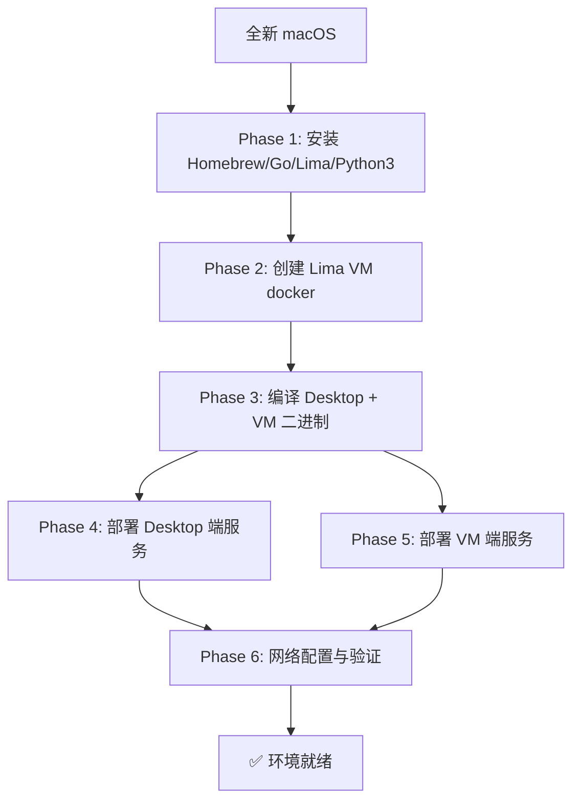
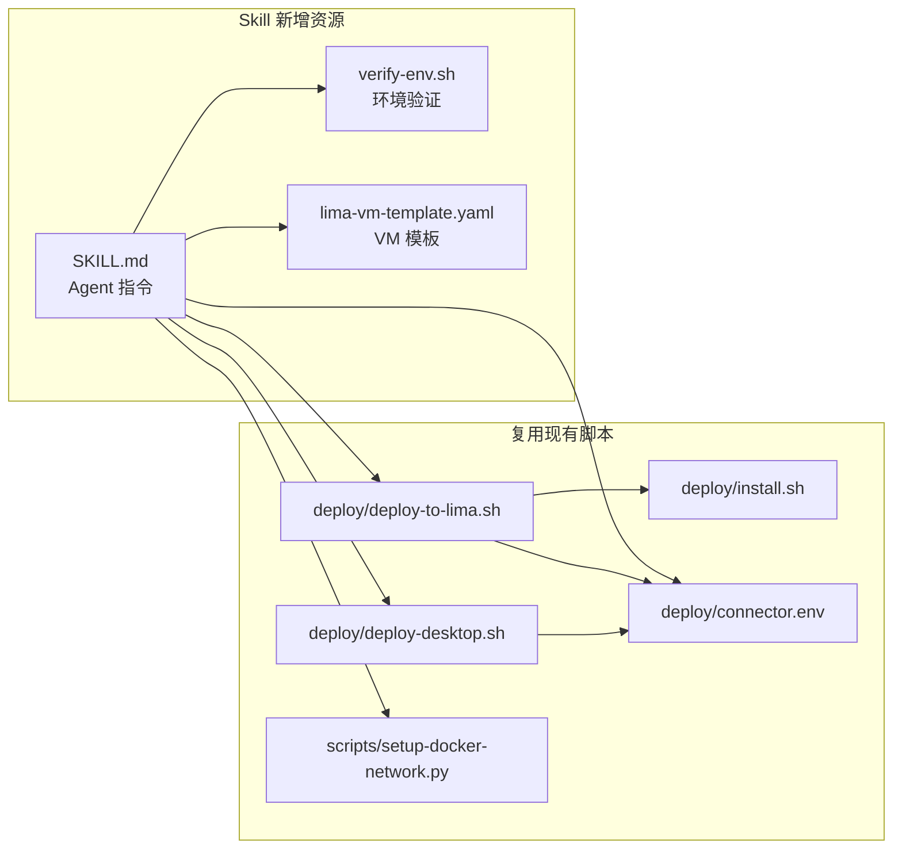

# env-init Skill 实施记录

## 需求描述

创建一个 `env-init` 技能（Skill），归档到本仓库中跟随 git 管理。该技能的目标是：从一个全新的 macOS 环境出发，Agent 可以通过此技能完整构建 mac-docker-connector 项目的运行环境，达到可用状态。

## 设计决策

| 决策项 | 结论 |
|--------|------|
| Lima VM 名称 | 固定为 `docker`（`limactl create --name=docker`） |
| Docker 运行方式 | 仅 Lima VM（不支持 Docker Desktop） |
| K8s/Minikube | 不包含，后续可扩展 |
| Desktop 端 host 配置 | `host.lima.internal`（固定） |
| 配置源 | `deploy/connector.env` 作为单一配置源 |

## 架构流程



## Skill 与项目脚本的关系



## 实施进展

### 已完成

- [x] 使用 `init_skill.py` 初始化 skill 目录结构（已迁移至 `skills/env-init/`）
- [x] 创建 Lima VM 模板 (`references/lima-vm-template.yaml`)，基于官方 `docker-rootful.yaml` 重写
  - `minimumLimaVersion: 2.0.0`
  - `base: template:_images/ubuntu-lts` + `template:_default/mounts`（官方镜像引用）
  - Docker 安装使用官方一键脚本 `curl -fsSL https://get.docker.com | sh`
  - `probes` 探针确保 Docker 安装成功且 dockerd 运行
  - `docker.socket` 转发到宿主机（支持 `docker context`）
  - `daemon.json` 启用 CDI 和 containerd snapshotter
  - 额外安装 `iptables` 和 `python3`（docker-connector 依赖）
  - 资源配置：4 CPU / 4GiB / 60GiB
  - Rosetta 启用 + 端口转发 2522
- [x] 创建环境验证脚本 (`scripts/verify-env.sh`)
  - 检查 6 个阶段的所有组件状态
  - 彩色输出 ✅/❌/⚠️
  - 汇总统计
- [x] 编写 SKILL.md（Agent 指令文件）
  - 6 阶段幂等执行流程
  - 每阶段包含命令、验证点
  - 配置参考和故障排查
- [x] 编写 README.md（人类可读文档）
  - 包含 mermaid 架构图
  - 文件结构说明
  - 注意事项和已知问题
- [x] 创建 SKILLS_COMMAND_MAP.md 映射表
- [x] 创建本实施记录文档
- [x] 从 `.codebuddy/skills/工程/env-init/` 迁移至 `skills/env-init/`（跟随 git 管理）
  - 更新所有文件中的路径引用
  - `verify-env.sh` 中 `PROJECT_ROOT` 路径计算从 `../../../../` 调整为 `../../../`
  - 删除旧的 `.codebuddy/skills/` 和 `.codebuddy/skills-docs/` 目录

### 未完成 / 后续扩展

- [ ] Minikube/K8s 初始化支持
- [ ] Lima VM 模板中的镜像源优化（国内加速）
- [ ] 实际端到端测试验证（在全新 macOS 上完整执行一次）

### 变更记录

| 日期 | 变更内容 |
|------|----------|
| 2026-04-14 | 初始创建 env-init skill |
| 2026-04-14 | 从 `.codebuddy/skills/` 迁移至 `skills/env-init/` |
| 2026-04-14 | 基于 Lima 官方 `docker-rootful.yaml` 重写 VM 模板 |

## 文件清单

```
skills/env-init/
├── SKILL.md                              # Agent 指令文件
├── README.md                             # 人类可读文档
├── scripts/
│   └── verify-env.sh                     # 环境验证脚本
└── references/
    └── lima-vm-template.yaml             # Lima VM 配置模板

skills/
└── SKILLS_COMMAND_MAP.md                 # Skills 命令映射表

docs/
└── env-init-skill.md                     # 本文件（实施记录）
```

## 遗留问题

1. **Lima VM 模板镜像源**：当前使用 Ubuntu 官方镜像源，国内网络可能下载缓慢，后续可考虑添加国内镜像源
2. **Homebrew 安装**：国内网络可能需要配置镜像源，SKILL.md 中未包含此步骤
3. **端到端验证**：尚未在全新 macOS 上完整执行一次，需要实际验证
