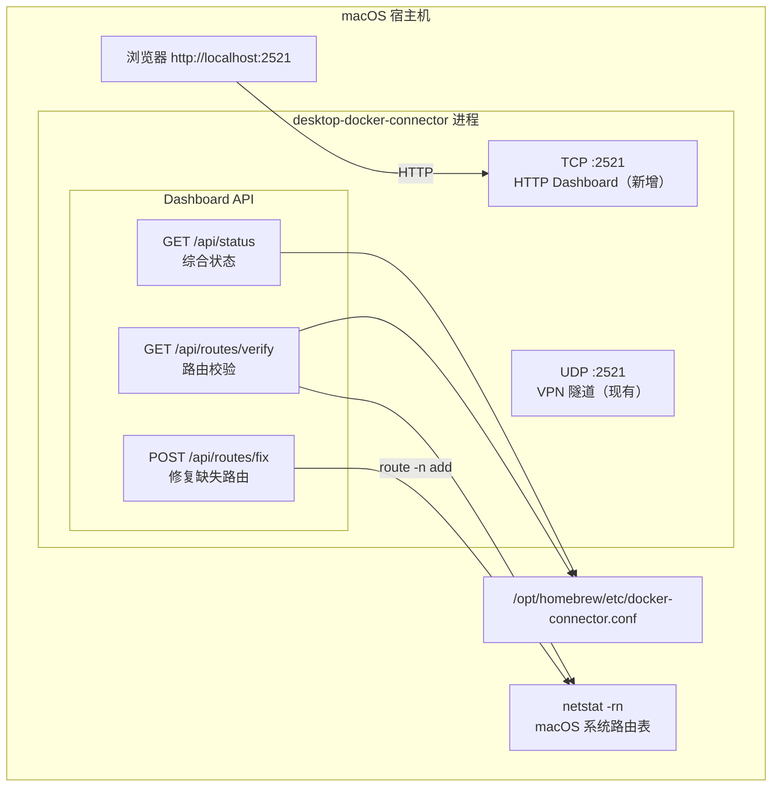
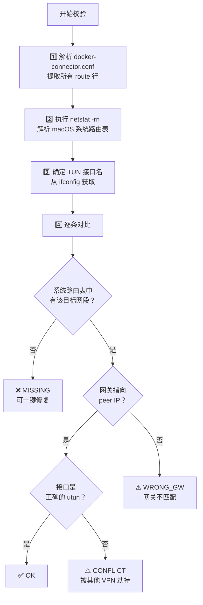

# Web Dashboard 需求文档

## 概述

为 `desktop-docker-connector` 添加内嵌的 Web Dashboard，提供路由校验、一键修复和状态可视化功能。

## 需求背景

当前在 `docker-connector.conf` 中设置 route 后，有时路由未能正确设置到 macOS 系统路由表中，需要手动执行 `route add` 命令。
缺少可视化工具来查看 conf 配置 ↔ 系统路由表 的同步状态。

## 功能范围

| 功能 | 说明 | 状态 |
|------|------|------|
| 路由校验面板 | conf 配置 ↔ 系统路由表交叉对比，标记 OK/MISSING/CONFLICT | Phase 1 |
| 一键修复路由 | 对 MISSING 路由执行 `route -n add` | Phase 1 |
| Connector 状态 | 运行时间、客户端连接、TUN 接口信息 | Phase 1 |
| VM 链路操作 | apply/revert/status（通过 limactl shell） | Phase 2（未实施） |

## 架构



## 端口方案

```
UDP :2521  →  现有 VPN 隧道（不变）
TCP :2521  →  新增 HTTP Dashboard（同端口号，不同协议，互不冲突）
```

## API 设计

| 端点 | 方法 | 描述 |
|------|------|------|
| `GET /` | GET | Dashboard 单页应用 |
| `GET /api/status` | GET | Connector 进程状态（uptime、client、tun 接口） |
| `GET /api/routes/verify` | GET | conf ↔ 系统路由表交叉对比 |
| `POST /api/routes/fix` | POST | 修复所有 MISSING 路由 |

## 路由校验逻辑



## 前端 UI

- **深色主题** + Bento Grid 布局
- **顶部卡片**：Connector 状态（运行时间、TUN 接口、Peer IP、客户端连接）
- **主区域**：路由校验表格（彩色状态标记：🟢 OK / 🔴 MISSING / 🟡 CONFLICT）
- **修复按钮**：检测到 MISSING 时显示"一键修复"按钮
- **自动刷新**：每 5 秒轮询

## 新增文件

```
desktop/
├── dashboard.go          # HTTP 路由 + 路由校验逻辑 + 修复路由
├── dashboard_html.go     # 内嵌前端 HTML/CSS/JS（原始字符串）
├── service.go            # 修改：在 run() 中启动 HTTP goroutine
└── ...
```

## 实施进度

| 步骤 | 内容 | 状态 |
|------|------|------|
| 1 | 创建需求文档 | ✅ 完成 |
| 2 | 创建 `dashboard.go` - HTTP 服务 + API (~350行) | ✅ 完成 |
| 3 | 创建 `dashboard_html.go` - 内嵌前端页面 (~280行) | ✅ 完成 |
| 4 | 修改 `service.go` - 启动 HTTP 服务 (2行) | ✅ 完成 |
| 5 | 编译验证 (go build 通过) | ✅ 完成 |

## 遗留问题

- [ ] Phase 2: VM 链路操作（limactl shell 调用 Python 脚本的 apply/revert/status）
- [ ] Phase 3: 自动修复 + 定时校验告警
- [ ] Lima VM 名称配置（用于 limactl shell 命令）
- [ ] `--no-dashboard` flag（可选关闭 Dashboard）
