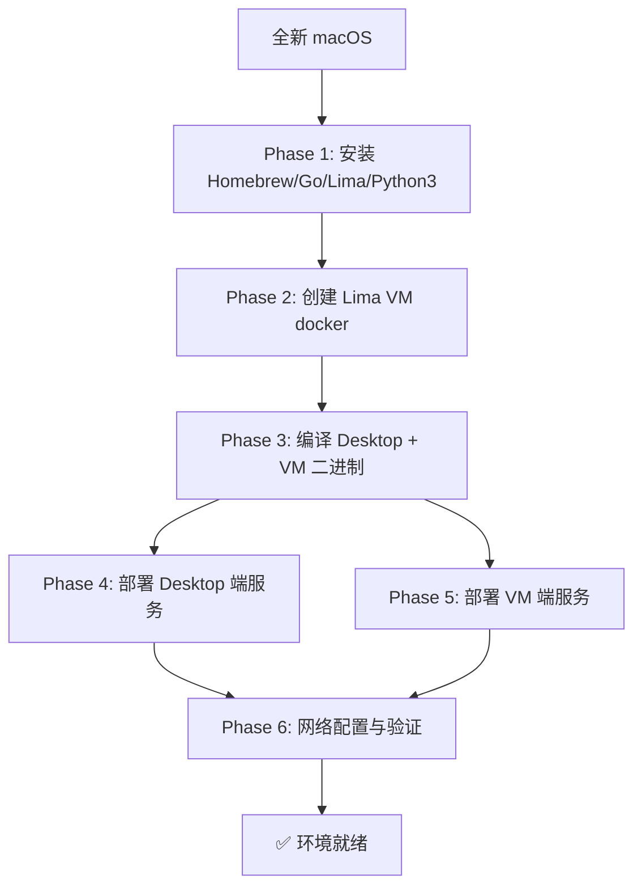
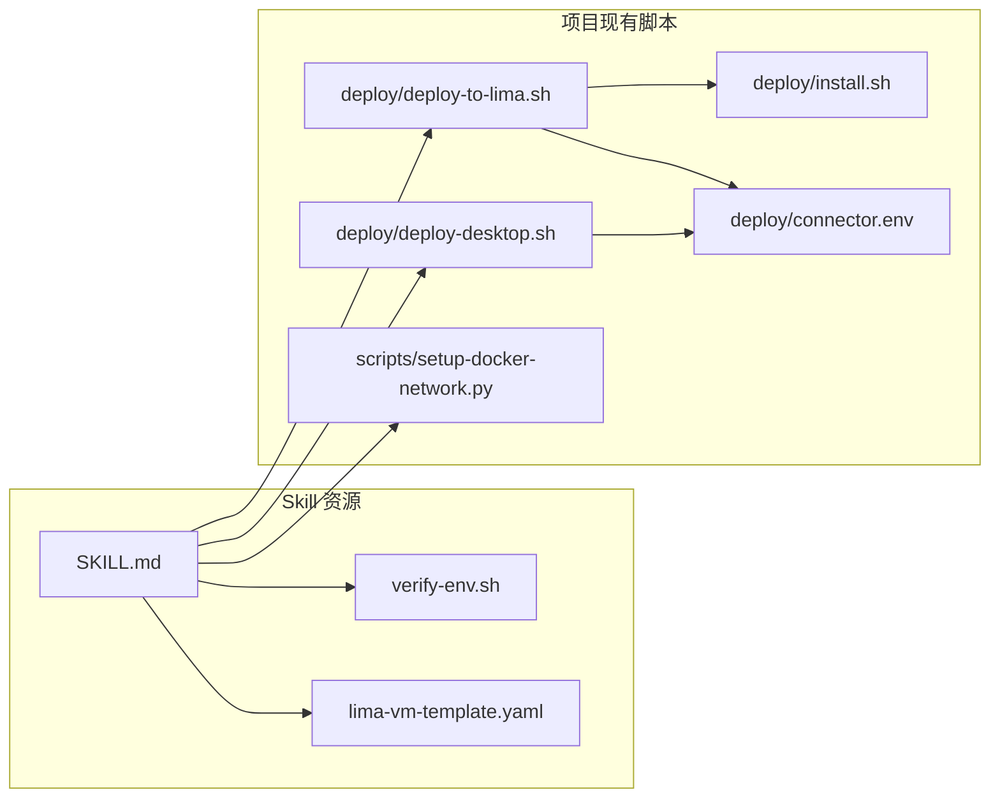

## 技能文档

### 基本信息
- 技能名: `env-init`
- 创建人: @junjiewwang (junjiewwang@tencent.com)
- 版本: v1.0.0
- 更新时间: 2026-04-14

### 适用场景
- 从全新 macOS 环境初始化 mac-docker-connector 项目的完整开发/运行环境
- 安装基础工具链（Homebrew、Go、Lima、Python3）
- 创建并配置 rootful Docker 虚拟机（Lima VM，名称固定为 `docker`）
- 编译并部署 Desktop 端和 VM 端服务
- 配置网络路由，打通 macOS 与 Docker 容器的网络连通

### 前置条件
- macOS 系统（Apple Silicon 或 Intel）
- 管理员权限（部分步骤需要 sudo）
- 网络连接（下载依赖和镜像）

### 使用示例
```
帮我初始化 mac-docker-connector 的开发环境
```
```
从零搭建 Docker 网络连通环境
```
```
检查当前环境状态
```

### 架构流程



### 文件结构
```
skills/env-init/
├── SKILL.md                              # Agent 指令文件（核心）
├── README.md                             # 本文件（人类可读文档）
├── scripts/
│   └── verify-env.sh                     # 环境验证脚本
└── references/
    └── lima-vm-template.yaml             # Lima VM 配置模板
```

### 与项目现有脚本的关系



### 注意事项
⚠️ VM 名称固定为 `docker`，所有 limactl 命令使用 `--name=docker`
⚠️ 仅支持 Lima 模式，不支持 Docker Desktop
⚠️ `deploy/connector.env` 是单一配置源，Desktop 和 VM 端配置从此同步
⚠️ VM 创建过程需要下载镜像，首次可能耗时 5-15 分钟
⚠️ Phase 4 需要先通过 `brew tap wenjunxiao/brew && brew install docker-connector` 完成首次安装

### 已知问题
- [ ] Minikube/K8s 初始化支持（后续扩展）
- [ ] Lima VM 模板中的镜像源可能需要根据网络环境调整
- [x] VM 名称固定为 `docker` (v1.0.0)

### 相关技能
- 暂无
